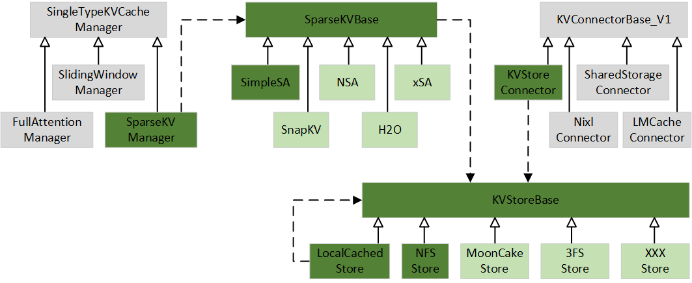

  <picture>
    <source media="(prefers-color-scheme: dark)" srcset="docs/source/logos/UCM-dark.png">
    
  </picture>

| <a href="docs/source/index.md"><b>Documentation</b></a> | <a href="https://modelengine-ai.net/#/ucm"><b>Website</b></a> | <a href="https://github.com/ModelEngine-Group/unified-cache-management/issues/78"><b>RoadMap</b></a> |

---

## Overview

The core principle of Unified Cache Manager (UCM) is to persist the LLM KVCache and replace redundant computations
through multiple retrieval mechanisms. UCM not only supports prefix caching but also offers a variety of training-free
sparse attention retrieval methods, delivering higher performance when handling extremely long sequence inference tasks.
Additionally, UCM provides a PD disaggregation solution based on a storage-compute separation architecture, which
enables more straightforward and flexible management of heterogeneous computing resources. When integrated with vLLM,
UCM achieves a 3-10x reduction in inference latency across various scenarios, including multi-turn dialogue and
long-context reasoning tasks.

### Motivation

With the increase of model size, the KV cache became larger and sparser, especially for long sequence requests. To
reduce the GPU memory used, offload full KV to external storage and only keep partial or compressed KV in GPU memory
became the popular direction. This can also reduce the GPU calculation, increase the sequence length and batch size of
decoding.

Sparse KV cache have many different choices. Recently paper point out that there is no common way can fit all scenarios
and all models. So better to build a common framework then different sparse algorithms can be plugin to it like KV
connector for PC.

All gray boxes are current classes in 0.9.2. Green boxes are proposed to add. Light green ones show out the future sub
classes base on this framework.

SpareKVBase is the base class of different algorithms. Just like KV connector design, it will hook few places of
scheduler and layer.py to allow sparse algorithms do additional load, dump and calculate sparse KV blocks.

SparseKVManager provide different KV block allocation methods for different algorithms. To keep all implementation under
SpareKVBase, it will call SparseKVBase and real implementation will happen in sub class of sparse algorithms.

KVStoreBase helps decoupling sparse algorithms and external storage. It defined the methods how to talk to external
storage, so any sparse algorithms can work with any external storage. Concepts here is blocks identify by ID with
offset. This is not only for sparse but also naturally for prefix cache also. KVStoreConnector connect it with current
KVConnectorBase_V1 to provide PC function.

NFSStore is sample implementation here provide ability to store blocks in local file system or NFS mount point in
multi-server case.

LocalCachedStore can reference any store to provide local DRAM read cache layer.

---

## Support Features

- Prefix Cache
- Cache Blend
- Model Window Extrapolation
- Prefill Offload
- Sparse Attention
- Sparse Attention Offload
- Heterogeneous PD Disaggregation

---

## Quick Start

please refer to [Quick Start](./docs/source/getting-started/quick_start.md).

---

## Branch

| **Branch** |     Status | vLLM version |
|-----------:|-----------:|-------------:|
|       main | Maintained |       v0.9.2 |
|    develop | Maintained |       v0.9.2 |

---

## Contact Us

For technical questions and feature requests, please use
GitHub [Issues](https://github.com/ModelEngine-Group/unified-cache-management/issues).

## License

UCM is licensed under the MIT with additional conditions. Please read the [LICENSE](./LICENSE) file for details.
