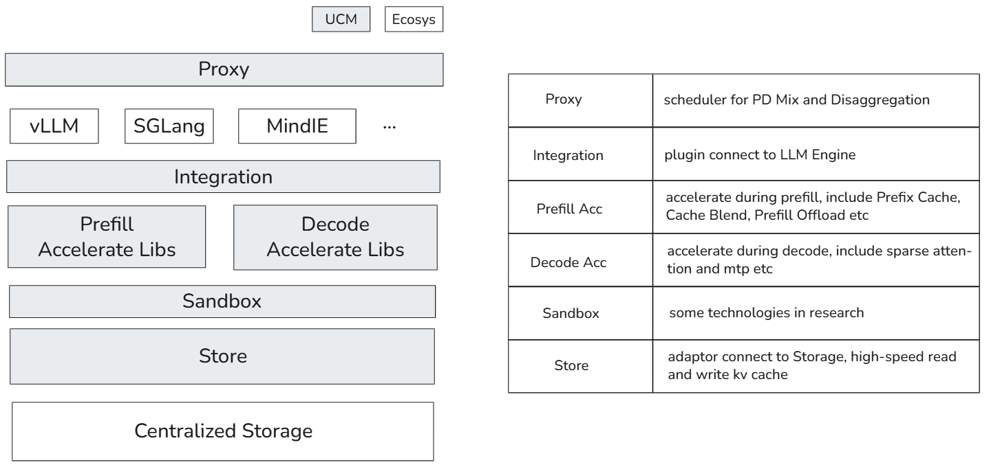

  <picture>
    <source media="(prefers-color-scheme: dark)" srcset="docs/source/logos/UCM.png">
    
  </picture>

| <a href="docs/source/index.md"><b>Documentation</b></a> | <a href="https://modelengine-ai.net/#/ucm"><b>Website</b></a> | <a href="https://github.com/ModelEngine-Group/unified-cache-management/issues/78"><b>RoadMap</b></a> |

---

## Overview

The core principle of Unified Cache Manager (UCM) is to persist the LLM KVCache and replace redundant computations
through multiple retrieval mechanisms. UCM not only supports prefix caching but also offers a variety of training-free
sparse attention retrieval methods, delivering higher performance when handling extremely long sequence inference tasks.
Additionally, UCM provides a PD disaggregation solution based on a storage-compute separation architecture, which
enables more straightforward and flexible management of heterogeneous computing resources. When integrated with vLLM,
UCM achieves a 3-10x reduction in inference latency across various scenarios, including multi-turn dialogue and
long-context reasoning tasks.

The ucm workflow is:

1. accelerate prefill by prefix cache and cache blend.
2. when prefilling, only 2 layers kvcache left in HBM, the one is in dumping and the other is calculating, others will be
   offload in Storage.
3. decode instance will load kvcache from storage, if we open sparse attention, only kvcache of selected tokens will be
   load to HBM.
4. accelerate by mtp

---

## Support Features
- [Prefix Cache]()
- [Cache Blend]()
- [Model Window Extrapolation]()
- [Prefill Offload]()
- [Sparse Attention]()
- [Sparse Attention Offload]()
- [Heterogeneous PD Disaggregation]()

---

## Quick Start

please refer to [Quick Start](./docs/source/getting-started/quick_start.md).

---

## Branch

| **Branch** |     Status | vLLM version | 
|-----------:|-----------:|-------------:|
|       main | Maintained |       v0.9.2 | 
|    develop | Maintained |       v0.9.2 |

---

## Contact Us
For technical questions and feature requests, please use GitHub [Issues](https://github.com/ModelEngine-Group/unified-cache-management/issues).

## License

UCM is licensed under the MIT with additional conditions. Please read the [LICENSE](./LICENSE) file for details.
