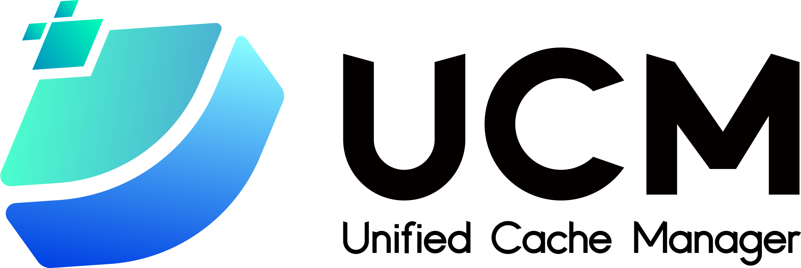

  <picture>
    <source media="(prefers-color-scheme: dark)" srcset="docs/source/logos/UCM-dark.png">
    
  </picture>

| <a href="docs/source/index.md"><b>文档</b></a> | <a href="https://modelengine-ai.net/#/ucm"><b>网站</b></a> | <a href="https://github.com/ModelEngine-Group/unified-cache-management/issues/78"><b>发展路线图</b></a> |

---

## 概述

统一缓存管理器（Unified Cache Management, UCM）的核心原理是持久化 LLM 的 KVCache，并通过多种检索机制替代冗余计算。UCM 不仅支持前缀缓存（prefix cache, PC），还提供了多种无需训练的稀疏注意力检索方法，在处理极长序列推理任务时达到更高性能。此外，UCM 基于存算分离架构提供了 PD 分离方案，使得异构计算资源的管理更加简单灵活。与 vLLM 集成后，UCM 在多轮对话和长上下文推理等多种场景下可将推理延迟降低 3–10 倍。

---

## 动机

随着模型尺寸的不断增长，KV 缓存也变得越来越大，且越来越稀疏，对于长序列请求来说尤为明显。为了减小 GPU 显存的使用，主流的方向是将全量的 KV 数据卸载到外部存储中，而在 GPU 显存中只保留部分或者被压缩的 KV 数据。这同时可以减小 GPU 的运算量，在解码时增加最大生成序列长度和批大小。

有许多种不同的稀疏 KV 缓存的实现。最新的论文指出，能够最好地适配所有场景和所有模型的方法是不存在的。因此，更好的做法是搭建一套公共的框架，并在此之上接入不同的稀疏化算法，就像 KV 连接器和 PC 一样。

所有灰色方块都是当前 0.9.2 版本中的类，深绿色的方块都是将要被添加的，而浅绿色的方块则展示了未来要实现的基于当前框架的子类。

SparseKVBase 类是不同稀疏化算法的基类。就像 KV 连接器的设计一样，它也会在调度器和模型层在几个地方进行挂钩，使得稀疏化算法可以进行对 KV 块数据额外的加载、落盘和计算操作。

SparseKVManager 类向不同的稀疏化算法提供了不同的 KV 块分配的方法。为了在 SparseKVBase 下保持所有实现，SparseKVBase 中的方法会首先被调用，而方法的真正实现则是在具体稀疏化算法的子类中。

KVStoreBase 类将稀疏化算法和外部存储解耦。它定义了如何与外部存储交互，使得稀疏化算法可以与外部存储协同工作。这里有个概念，是由 ID 和 offset（偏移量）决定的块的唯一标识。这不仅适用于稀疏化算法，也适用于 PC。KVStoreConnector 通过这个唯一标识与当前的 KVConnectorBase_V1 进行连接，提供 PC 功能。

NFSStore 是当前的一个样例实现，在多机的场景下提供了将 KV 块数据存入本地文件系统或者 NFS 挂载点的能力。

LocalCacheStore 可以使用任意一种 store，来提供对本地 DRAM 缓存的读取能力。

---

## 支持特性
- [前缀匹配]()
- [缓存融合]()
- [模型窗口外推]()
- [预填充卸载]()
- [稀疏注意力]()
- [稀疏注意力卸载]()
- [异构PD分离]()

---

## 快速开始

请参考 [快速开始](./docs/source/getting-started/quick_start.md).

---

## 分支

| **分支**   |     状态   | vLLM 版本 | 
|-----------:|-----------:|-------------:|
|       main | 维护中 |       v0.9.2 | 
|    develop | 维护中 |       v0.9.2 |

---

## 联系我们
如需技术咨询或功能请求，请提交 GitHub [Issues](https://github.com/ModelEngine-Group/unified-cache-management/issues).

## 许可协议

UCM 采用 MIT 许可证（附加额外条件），详情请参阅 [LICENSE](./LICENSE) 文件。
