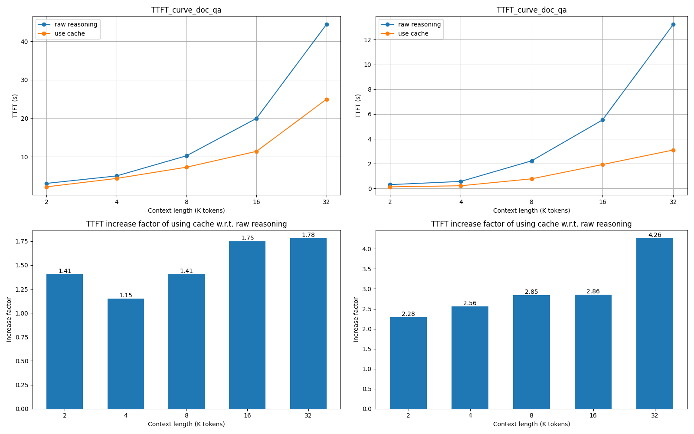

# Performance Benchmark

***

This document shows how to measure the performance (and accuracy, coming soon) of unified-cache-manager integrated with LLM API server.

Our dataset includes doc-qa questions with context lengths of 2k, 4k, 8k, 16k, 32k and 64k, each corresponding to a jsonl file under the directory src/llmperf.

**Benchmark Coverage**: We measure e2e latency and throughput, together with TTFT, TPOT, etc. TTFT is the key metric that we emphasize on now. 

### 1. Create a new conda environment to run our performance benchmark

***

#### Basic requirements

***

+ python >= 3.8 and <= 3.10, 3.10 is recommended

Run
```
pip install -e .
```

to install the llmperf library by source code on your environment.

### 2. Run the test script

***

```
bash doc-qa.sh -m <path-to-your-model> -c <connector> -d <result-output-directory> -l <context-lengths> -i <llm-server-ip> -p <llm-server-port> -b <compute-device-backend> [-s <CacheBlend split string>]
```

#### Arguments explanations

+ **-m**: Path to your model.
+ **-c**: Connector that llm server uses. Can be any string, like "NFS" or "DRAM".
+ **-d**: Path to save the performance results.
+ **-l**: All context lengths to measure the performance (**Unit: k tokens**). Separate different lengths with commas. For example, you can set "**-l 2,4,8**" if you want to measure the performance on context lengths of 2k, 4k and 8k.
+ **-i**, **-p**: IP address and port of your LLM server.
+ **-b**: Compute device backend. Can be any string, like "NPU" or "GPU".
+ **-s**: (Optional) Cacheblend split string. Should align with the LMCACHE_BLEND_SPECIAL_STR in the settings of CacheBlend.

### 3. Performance results

***

The context_length-TTFT figure will be saved automatically under the {result-output-directory} you just set. The filename is organized in the format

```
docqa_TTFT_{path-to-your-model}_{connector}_{compute-device-backend}
```

Below shows the results we obtained using NFS connector on Nvidia-L40-GPU (left) and Ascend-NPU (right) backends with context lengths of 2k, 4k, 8k, 16k, 32k.


