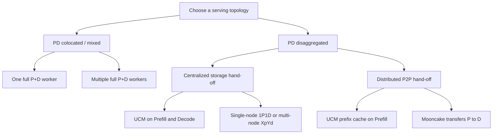

# Deploy Modes

UCM deployment has two independent decisions:

1. whether Prefill and Decode run in the same serving instance; and
2. when they are separated, whether KV cache moves through shared storage or a
   direct P2P transport.

Keeping these decisions separate prevents a common configuration error:
`UCMConnector` with `kv_role: kv_both` is the centralized storage path, while
Mooncake producer/consumer roles belong to the distributed P2P path.

## Architecture map

## Step 1: Choose the P/D topology

| Topology | Request execution | Start here when |
| --- | --- | --- |
| [PD Colocated](pd-colocated.md) | One full worker performs both Prefill and Decode | You want the simplest service, a baseline, or a pool of interchangeable workers. |
| PD Disaggregated | A router sends the request through separate Prefill and Decode pools | You need independent P/D scaling, isolation, or different P/D hardware. |

Start with colocated mode to establish correctness and a performance baseline.
Choose disaggregation only when the benefit of independent P/D scheduling is
worth an extra routing and KV hand-off stage.

## Step 2: For PD Disaggregated, choose the KV hand-off

| Hand-off | KV path | Main requirement |
| --- | --- | --- |
| [Centralized / shared storage](pd-disaggregated.md#centralized-hand-off-ucm-shared-storage) | Prefill → UCM storage → Decode | P and D must access the same UCM backend. |
| [P2P / UCM + Mooncake](pd-disaggregated.md#p2p-hand-off-ucm-mooncake) | UCM caches prefixes on Prefill; Mooncake transfers the request KV to Decode | Mooncake control/data plane and stricter topology coupling. |

Choose centralized PD first when shared-storage bandwidth is sufficient. Move
to P2P only after measurement shows that the storage-mediated KV hand-off is a
material bottleneck.

## What “single-node” and “multi-node” mean

| Term | Meaning in these guides |
| --- | --- |
| Colocated, single-node | One vLLM process performs both phases on one accelerator allocation. |
| Colocated, multi-node | Multiple independent full P+D workers sit behind a router. |
| Disaggregated, single-node | Separate Prefill and Decode processes use different accelerators in one host. |
| Disaggregated, multi-node | Prefill and Decode pools run on different hosts; the smallest topology is 1P1D and the general form is XpYd. |

## Cache compatibility contract

Every process that reuses or transfers one cache representation must agree on:

- model, tokenizer, model revision, quantization, and chat template;
- KV cache dtype, block size, attention layout, and parallel cache layout;
- UCM and serving-engine integration versions;
- deterministic block-key inputs, including `PYTHONHASHSEED` where required.

For heterogeneous CUDA/NPU centralized PD, explicitly set the same `--dtype`
on both engines. A model merely loading on both platforms does not prove that
their serialized cache representations are compatible.

## Storage and network contract

- A single-node example may use local NVMe.
- Colocated workers share cache only if their UCM backend is shared.
- Centralized multi-node PD requires the same backend to be readable and
  writable by every Prefill and Decode process.
- Distributed P2P PD only requires the UCM backend across Prefill instances;
  Decode receives the current request's cache through Mooncake.
- Router, vLLM, Mooncake metadata, and Mooncake transfer ports must be reachable
  according to the selected architecture.

## Production boundary

The repository's `ucm.pd.toy_proxy_server` is intentionally a validation
router. It provides request sequencing and round-robin selection, but not
production admission control, health-aware balancing, retries, backpressure,
authentication, or high availability.

## References

- [UCM centralized PD disaggregation](https://ucm.readthedocs.io/en/latest/user-guide/pd-disaggregation/centralized_pd.html)
- [UCM distributed PD on Ascend](https://ucm.readthedocs.io/en/latest/user-guide/pd-disaggregation/distributed_pd.html)
- [UCM large-scale EP PD](https://ucm.readthedocs.io/en/latest/user-guide/pd-disaggregation/large_scale_ep.html)
- [vLLM Ascend feature tutorials](https://docs.vllm.ai/projects/ascend/en/latest/tutorials/features/index.html)
