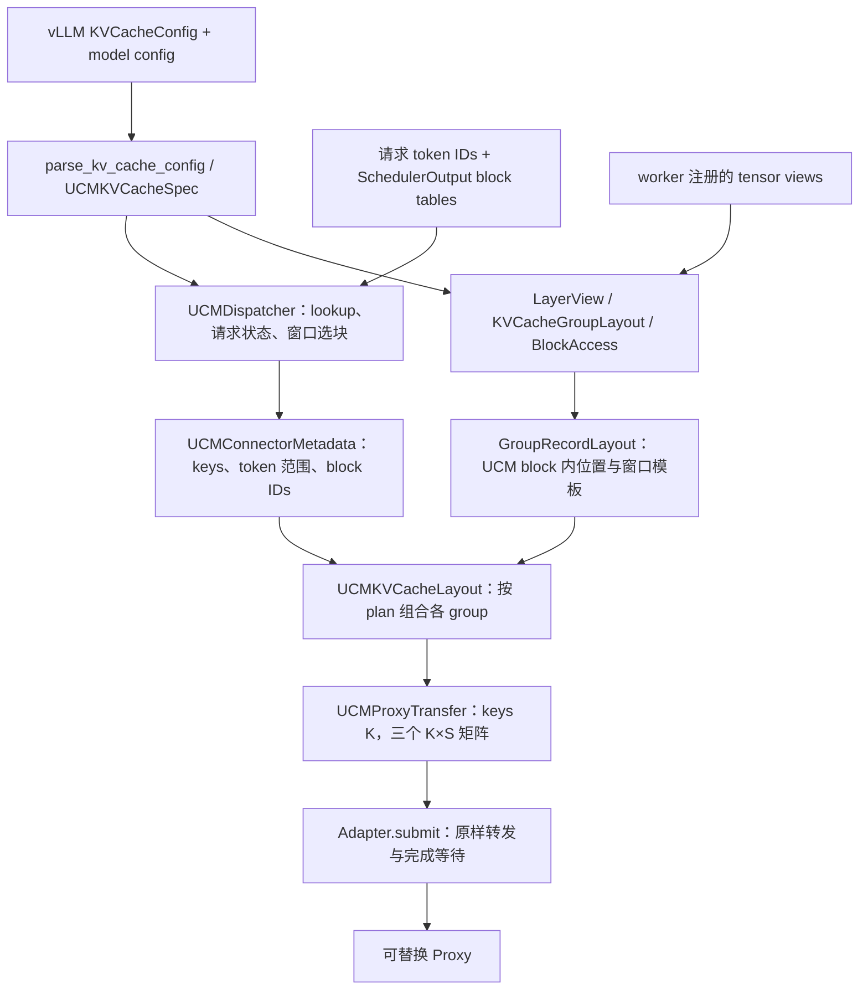

# UCM Connector v2 详细设计

更新时间：2026-09-20。源码基准：`dev_connector`，HEAD `49ff4b75`，目录 `ucm/integration/vllm/v2/`。

本文描述当前实现。2026-09-26 增加 layerwise 回调和显式 commit；异步任务边界已接入，当前文件 Proxy 仍同步执行。文中的 UCM block 是一个 key 对应的存储记录，vLLM block 是 KV 池中的物理块，两者不是同一个概念。本文不描述旧版 `ucm/integration/vllm/ucm_connector.py` 的实现。

## 1. 目标与当前状态

v2 将不同模型的 Full Attention、Sliding Window 和 Mamba 状态统一成三类工作：

1. scheduler 根据 hash 链、缓存命中和 block table，决定恢复或保存哪些窗口。
2. worker 根据已经注册的 tensor views，将窗口转换为源/目标内存地址、长度和 UCM block 内位置。
3. Proxy 按这些字节描述符搬运数据。

当前关键约定：

- 单请求的 hash 链 keys 按唯一处理。worker 不扫描唯一性，不维护 key 校验缓存，也不对一个 plan 做重复 key 分区。
- 每个非空且有选中数据的 plan 生成一个二维 Transfer；不同请求独立提交。跨请求相同 key 可以对应不同 load 目标，不能丢掉其中一个目标。
- 原生 `Adapter.submit` 原样转发四个字段，不做逐元素校验或 dtype 转换。
- 地址和大小主要用 NumPy 批量计算，但仍有请求、plan、group 级 Python 循环，不等于多核或设备端并行。
- worker 默认使用同步 bulk load/dump；`use_layerwise: true` 启用逐层传输和按层等待，步末等待保存任务并 commit。
- `SimpleFileUCMProxy` 是可替换的开发后端，不是多级存储管理器；存储层的解析策略不决定寻址层设计。

## 2. 模块职责与数据流



| 文件/对象 | 负责 | 不负责 |
|---|---|---|
| `ucm_connector.py / UCMConnector` | 对接 vLLM hooks，初始化组件，转发 metadata、错误与完成信息 | 手工解释 head strides 或拼接存储位置 |
| `ucm_scheduler.py / UCMDispatcher` | hash、lookup、维护 block tables、生成计划 | worker 指针、tensor strides |
| `ucm_kv_cache.py / UCMKVCacheSpec` | group 分类、token/state 粒度、路由、声明布局解析 | 实际内存搬运 |
| `layout/view.py` | 将逻辑 tensor views 分解为可连续寻址的 segments | hash key、UCM block 排布 |
| `layout/group.py` | group 物理几何、层选择、块内范围到 ptrs/sizes 的转换 | key 和目标存储位置 |
| `record_layout.py` | 每个 group 在 UCM block 中的窗口排布、offsets、合并条件 | 文件格式、异步任务调度 |
| `ucm_kv_cache.py / UCMKVCacheLayout` | 关联 plan 与 layouts，生成二维 Transfer | 存储实现细节 |
| `ucm_proxy.py` | Transfer 契约、下发适配、当前文件后端 | scheduler 的窗口语义 |

源码入口：[connector](../ucm/integration/vllm/v2/ucm_connector.py)、[scheduler](../ucm/integration/vllm/v2/ucm_scheduler.py)、[语义与批次构造](../ucm/integration/vllm/v2/ucm_kv_cache.py)、[物理 group](../ucm/integration/vllm/v2/layout/group.py)、[view](../ucm/integration/vllm/v2/layout/view.py)、[record layout](../ucm/integration/vllm/v2/record_layout.py)、[Proxy](../ucm/integration/vllm/v2/ucm_proxy.py)。

## 3. 核心概念与单位

| 名称 | 含义 | 单位/范围 |
|---|---|---|
| `scheduler_block_size` | vLLM `resolve_kv_cache_block_sizes` 返回的 scheduler 粒度 | tokens，不直接照抄原始配置值 |
| `ucm_cache_block_size`，下称 U | hash 链一步覆盖的 token 数；一个 FA key 的 token 范围 | tokens |
| `group.token_block_size`，下称 T | 该 group 一个物理 block ID 覆盖的 token 数 | tokens |
| `storage_block_size` | 一个 layer 的逻辑 block 实际包含多少 stored states | states，压缩缓存不等于 tokens |
| `tail_tokens` | WA 在一个边界保存的尾部范围 | tokens |
| `tail_blocks`，下称 R | 一个 key 在一个 group 中涉及的物理块数 | FA 为 ceil(U/T)，WA 为 ceil(tail/T)，State 为 1 |
| `layer_name` | vLLM 注册的一个缓存名字 | 同一个模型层可能有 attention/indexer/state 等多个名字 |
| `layer_id` | 模型层编号 | 一个编号可关联多个名字和多个 group |
| component view | 一个已注册的 tensor 逻辑视图 | 不意味着一块独立物理分配 |
| `MemorySegment` | 一个逻辑 block 内可按连续 state/token 范围寻址的字节段 | 一个 view 可以有多个 segments |
| `block_byte_offsets` | 从源 block 内 segment 起点跳过的字节数 | 源内存偏移 |
| `group_block_offsets` | 完整 vLLM block 的各 segment 在 group 内的目标排布 | bytes |
| `ucm_block_offsets` | 某个 key 的各段在 UCM block 中的位置 | bytes；group 模板内先相对 group，最终加 group 基址 |
| `record_bytes` | 一个 key 中某个 group 窗口占用的总空间 | bytes，选择部分层不会改变它 |

区分两类重复：不同 UCM keys 可以引用同一个物理 block 的不同 token 范围；这不等于同一请求出现重复 hash key。

## 4. 初始化与配置解析

### 4.1 Connector 初始化

`UCMConnector.__init__`：

1. 通过共用的 `ucm.utils.Config` 读取启动配置，支持已有配置文件/输入形式。
2. 调用 vLLM 的 `resolve_kv_cache_block_sizes` 获取解析后的 scheduler 粒度。
3. 建立运行上下文：role、device_type、rank、world_size、engine_id。
4. 从模型配置读取压缩比与层数，补足 scheduler representative spec 可能丢失的 DSV4 逐层信息。
5. 解析 `UCMKVCacheSpec`。scheduler 与 worker 使用相同语义规则。
6. 建立当前文件 Proxy 和 Adapter；仅 scheduler 建立 `UCMDispatcher`。
7. worker 在 `register_kv_caches` 收到实际 views 后，才建立物理 layout 与 record templates，并向 Proxy 注册 storage。

当前文件路径为：

```text
storage_root/.ucm-v2/{device}-{model_dtype}-b{scheduler_block_size}-c{U}-r2/
```

`storage_root` 优先来自 `v2_storage_path`；否则要求一个 `ucm_connectors` 配置项，读取其 `storage_backends` 的第一个路径。`-r2` 标识既有 block-major 记录格式，改变格式时必须重新评估兼容性。当前 dtype 字段来自 model dtype，不应将其解释为已完整隔离所有 KV cache dtype。

### 4.2 语义 spec

`parse_kv_cache_config`：

- 将 group 的统一或逐层 spec 展开为 `UCMLayerSpec`，分类 attention/sliding/state。
- 官方 0.29 的 `KVCacheTensor.layers/offset/layer_stride/block_stride` 转成 `TensorDescriptor`；旧 Ascend 入口没有相同声明时以实际 views 为依据。
- Ascend attention 的 `compress_ratio` 与官方 0.29 的 `tokens_per_state` 归一为 token/state 关系。不能仅看 shape 推导业务上的 token 跨度。
- 根据名字提取模型层编号；Ascend MTP 局部编号按模型层数调整。
- Mamba 当前要求 `mamba_cache_mode='align'`，并要求相关 group block 粒度与 scheduler 粒度一致；不支持 State-only 模型路径。
- 普通 `swa_cache` 的 tail 使用整个 window；压缩状态的 tail 使用 window 减对应层的 attention 压缩比。tail 为零的 group 不进入 WA 存储路由。

U 的默认选择为所有 FA group 的最小 T；没有 FA 时回退到 scheduler 粒度。显式覆盖仅支持单 group，要求为 scheduler 粒度的正整数倍。

窗口静态化约束：FA 中 U、T 必须一方整除另一方；WA 中非零 tail group 的 T 必须整除 U。否则一个 key 的窗口形状可能随边界变化，当前固定矩形模板不支持。

`dispatch_routes()` 按 FA → WA → State 建路由，只保留非空类别。WA 只包含 tail>0 的 group。plan.windows 的位置必须与该路由的 group 顺序一致。

## 5. Hash、lookup 与 scheduler 计划

### 5.1 Hash 链与 key

`RequestHasher` 在 MD5 输入中加入 model 名称末段、TP size、model dtype、rank 参数、speculative 配置和 sparse 开关。token ID 先转 Python int，避免 NumPy 标量改变序列化结果。

```text
parent_0 = hasher("UCM_HASH_SEED")
parent_i = hasher((parent_(i-1), 当前 U 个 token 的 tuple))
key_i    = parent_i[:14] + 2 字节 tag
```

不足 U 个 token 的尾部不产生 key。FA/WA/State 共享同一条 parent 链，只改变 tag。

tag 大端布局：`type(2) | group(4) | tp_rank(4) | pp_rank(4) | reserved(2)`；当前 group bits 为零，所有同类 group 合在一个记录里。当前 Connector 用逻辑 rank-0 namespace 创建 keys，不能据此推断 worker 分片隔离已完成。

单请求链式 keys 唯一是当前输入契约，不另做运行时碰撞检测。跨请求共享前缀可拥有相同 keys，仍使用各自 block tables。

### 5.2 Lookup

`lookup` 建立/更新 `RequestState`，保存 HBM 命中、external 命中、已处理边界、各链 keys、各 group block tables 和 `load_pending`。

- 查找上界：`floor((num_tokens - recompute_tokens)/U)`，默认保留一个 token 重算余量。
- FA 调 `lookup_on_prefix`，返回最后一个连续命中 key 的相对下标，`-1` 表示无命中。
- WA/State 在 FA 可恢复范围内调用 `lookup_on_reverse`，返回最右命中下标。
- 当前算法将恢复终点收敛为 FA 终点与各边界链命中位置的最小值；任一边界链无命中则不恢复。
- external 命中量不超过 `load_tokens_threshold` 时抑制本次 load。

边界说明：当 WA 与 State 同时存在且各链记录缺失位置不一致时，“各自最新命中的最小值”不自动证明该位置被所有链共同命中；当前算法没有回查这个交点。这里记录实现及适用假设，不把它写成任意缺失分布下都成立的保证。

### 5.3 Block table 与 metadata

`build_from_scheduler_output` 从 vLLM SchedulerOutput 更新 block tables：新请求和 resumed 请求替换表，普通 cached 请求追加新分配的 blocks。`update_state_after_alloc` 当前为空，避免两条路径重复维护。

```python
UCMGroupDispatchPlan(
    hash_group="FA" | "WA" | "State",
    keys=tuple[bytes, ...],
    token_start=int,
    token_end=int,
    windows=tuple[np.ndarray, ...],
)
```

`windows[g]` 是 uint64 一维数组，逻辑上为 `[K,R_g]` 后展平；每个 key 的窗口按老块到新块排列。传递的是物理 block IDs，不是虚拟地址。`RequestDispatchMeta` 分别持有 load/dump plans，`UCMConnectorMetadata` 再按 request_id 组织，并携带 preempted/finished IDs。

每步 `_request_meta`：

- 有待加载且本步有 scheduled tokens 时，产生 HBM 终点到 external 终点的 load plans，并清除 `load_pending`。
- dump 区间从 `token_processed` 到本步处理终点，终点不超过 lookup 时记录的 token 数。
- 生成计划后推进 `token_processed`；finished/preempted 请求移出 dispatcher 状态表。

### 5.4 选 key 与选 block

对于区间 `[token_start, token_end)`：`first=floor(token_start/U)`，`last=floor(token_end/U)`。若 last<=first，无完整新边界，不生成 plan。

| 类别 | keys | 每个 key 保存的窗口 |
|---|---|---|
| FA | `[first,last)` 中所有 keys | key 覆盖的 U tokens |
| WA | 仅 `last-1` | `last*U` 边界之前各 group 的 tail |
| State | 仅 `last-1` | 该边界的完整状态页 |

WA 若边界小于该路由最大的 tail，跳过整个 plan，避免负下标与不完整记录。

选块公式：FA key k 的末 token 为 `(k+1)*U-1`；WA/State 使用最新边界 `last*U-1`。除以 T 得到 block table 的逻辑位置，从该位置向前取 R 个 entries，转换为物理 block IDs。只将实际窗口覆盖的 table 子区间转成 ndarray，避免小 WA 窗口扫描整张长表。

## 6. 物理 view：shape、stride 与 segment

### 6.1 对象关系

```text
KVCacheGroupLayout
  layer_views[layer_name] -> LayerView
    components -> ComponentView × 1..n
      shape / strides
      segments -> MemorySegment × 1..n
```

这里的 component 是逻辑 view，多个 components 可以共享同一个 storage。`LayerView` 不分配 KV 内存；`tensor.data_ptr()` 已包含该 view 的 storage offset，不能再加一遍。

`MemorySegment` 保存 block-0 基址、block 字节步长、每块 state 数、每 state 字节数和完整 payload 字节数。segment 的基址可以是某个 head 的起点，不一定是整个 tensor 的起点。

### 6.2 官方 vLLM 0.29 的布局解释

官方 0.29 的逻辑轴固定为整体 `[L,B,H,N,C]`、单层 `[B,H,N,C]`；物理布局枚举描述轴在内存中的顺序。N 对压缩 attention 可以是 stored states，而非原始 tokens。

例如无 padding、单层 shape `[4,2,8,16]`：

| 物理布局 | 单层逻辑 shape | 元素 stride |
|---|---|---|
| LBNHC | `[4,2,8,16]` | `[256,16,32,1]` |
| LBHNC | `[4,2,8,16]` | `[256,128,16,1]` |

两者都用 `view[b,h,n,c]`，地址均为 `data_ptr + element_size*(b*sB+h*sH+n*sN+c*sC)`，变化的是 sH/sN。layout 选定后，vLLM 用 `compute_layout_strides` 和 `torch.as_strided` 建立 view；创建 view 不搬运数据，后续内核按支持的布局读写。

因此 `token_axis=2, head_axis=1` 描述官方 0.29 view 的逻辑 ABI，不代表物理布局只能是 LBHNC。Ascend 0.26 四维 attention view 按 BNHC 解释，使用 token_axis=1/head_axis=2。当前实现以 device_type 分支选择这两套已支持的约定；这不是“所有非 NPU 版本都永久采用 BHNC”的承诺。

### 6.3 为什么一个 view 会拆成多个 ptrs

- NHC 连续：一个 token 的所有 heads 连续，可把一个 view 当作一个 segment。
- HNC 连续：每个 head 的 tokens 连续，但选一段 tokens 时，不同 heads 的数据不相邻，按 head 拆 segment。
- LHBNC/BHLNC：head 之间还可能夹其他 block/layer；同样使用真实 head stride 计算各 segment 基址。
- 当前要求 channels 连续、strides 为正。多个 kernel rows 可以在密集排列时折算成一个逻辑块；多个 kernel rows 且 head 分离的组合明确拒绝。
- Mamba/State 不按 token 切片。匹配 spec 的 components 或支持的原始字节页形式按整页解析，保留必要的 page stride/padding 语义。

整个 block 的字节连续，不代表该 block 中任意 token 子区间也连续；这是必须区分 view 与 segment 的原因。

## 7. GroupKVCacheLayout 与 BlockAccess

代码类名为 `KVCacheGroupLayout`。group 内按 `(layer_index, layer_name)` 排序，再按 component/segment 顺序展开为列。主要列是 `base_ptrs`、`block_strides`、`state_strides`、`states_per_block`、`payload_bytes`，均为 uint64；名字与 layer ID 用来选择列。

### 7.1 初始化编译范围

```python
access = group_layout.compile_access(
    token_offsets=0,
    token_counts=512,
    layer_ids=[7],  # 可省略
)
ptrs = access.resolve_ptrs(block_ids, token_offsets=dynamic_starts)
```

`compile_access` 将 starts/counts 转为固定的 `block_byte_offsets` 与 `segment_bytes`，形状 `[R,V]`。标量应用于所有行；数组表达重复窗口的各块。省略 counts 时到块末尾。State 只允许整块。

对 segment j，T tokens 对应 P_j 个 states，每 state 为 D_j bytes：

```text
bytes_j(t) = (t * P_j / T) * D_j
```

必须整除，不能切半个压缩 state。相同转换用于 start 的跳过字节和 count 的长度。

### 7.2 运行时解引用

对于窗口行 r、输入 block b、segment j：

```text
ptr[b,j] = base_ptr[j]
         + block_id[b] * block_stride[j]
         + fixed_byte_offset[r,j]
         + bytes_j(dynamic_token_start[b])
size[b,j] = compiled_segment_bytes[r,j]
```

动态 start 是在固定 start 上追加，若传的是绝对块内 start，应编译零起点模板。代码先选择列，再批量生成地址，不会先算全部层再挑一层；没有长期缓存所有 block 的 ptrs。

`resolve` 返回独立可写 ptrs/sizes 网格；二维 Transfer 路径使用 `resolve_ptrs`，避免提前扩展不随 key 改变的 sizes。

源寻址层仍检查 block IDs、窗口行数、动态 start 与 state 对齐、范围是否越过 payload。删除的是 Adapter 的重复字段检查，不是所有层的所有检查。

## 8. UCM block 排布与块内切片

`GroupRecordLayout` 将物理 segment 映射到一个 key 对应的存储位置，物理 group 不需要理解存储 offsets。

```text
一个 FA key -> 一个 UCM block
  group 0
    window block 0（最老）
      layer 0 / component / segment ...
      layer 1 / component / segment ...
    window block 1
      layer 0 / component / segment ...
      layer 1 / component / segment ...
  group 1
    window block 0
      ...
```

WA/State 使用各自路由的 groups 和窗口，不混进 FA key 中。普通完整块的 segment 紧凑累加；满足声明的 Block First 路径保留其完整块 padding。

### 8.1 三种 FA 关系

| 关系 | R | 块内起点 | 长度 |
|---|---:|---|---|
| U=T | 1 | 0 | 完整块 |
| U>T，U 整除关系成立 | U/T | 各块为 0 | 多个完整块 |
| U<T，T 是 U 的倍数 | 1 | `(key_index*U) % T` | 固定 U tokens |

WA 的第一块可能是部分块：count=`tail%T`，start=`T-count`；其余块完整。余数为零时所有块完整。State 一页不可拆。

固定 sizes 在初始化时计算；FA 子块只是运行时改变 starts。一般查询仍可通过重新 compile starts/counts 表达不同范围，但当前 plan 热路径不传逐 key ends。

### 8.2 数字例子：16384-token block 切成 512-token UCM blocks

假设一个 group 有两层，每层每 token 4 bytes，两个 layer 的 block-0 基址分别为 1,000,000 和 2,000,000，每块步长为 65,536 bytes。两个不同 keys 引用物理 block 2 的相邻片段：

```text
keys       = [A, B]
block_ids  = [2, 2]
starts     = [0, 512]           # tokens
count      = 512               # tokens，固定

ptrs = [[1131072, 2131072],
        [1133120, 2133120]]
sizes = [[2048, 2048],
         [2048, 2048]]
ucm_block_offsets = [[0, 2048],
                     [0, 2048]]
```

选择第二层后只保留第二列，offset 仍为 2048，不重新变成零。逻辑 block ID 取决于 vLLM 分配，不必等于 key_index。

### 8.3 Block First 合并

`_block_first_span` 验证 descriptors 及实际地址：每层一个 component、segments 构成连续页、页可容纳在 layer_stride 内、`0<layer_stride<block_stride`、descriptor offset 链和实际基址匹配。

record 层进一步要求整块、未筛选层、源 segment 相对位置与目标排布完全一致，才合并成一个 group block 一个 span。只凭 descriptor 名称或两个 offset 相邻，不足以合并。padding 包含在这一完整 span 内。

## 9. Transfer 构造与 Proxy 边界

### 9.1 二维契约

```python
@dataclass(frozen=True)
class UCMProxyTransfer:
    keys: tuple[bytes, ...]         # [K]，plan 内唯一
    ptrs: np.ndarray               # uint64 [K,S]
    sizes: np.ndarray              # uint64 [K,S]，字节数
    ucm_block_offsets: np.ndarray  # uint64 [K,S]，完整 UCM block 内字节偏移
```

S 是这次选择后每个 key 的搬运段数，不一定等于层数。一般为各参与 group 的 `R_g * selected_segments_g` 之和；合并整块时该 group 可降为 R_g。

对第 k 行第 s 列：

```text
dump：从 ptrs[k,s] 读 sizes[k,s] 字节，写到 key[k] 的 ucm_block_offsets[k,s]
load：从 key[k] 的该位置读相同字节数，写入 ptrs[k,s]
```

### 9.2 构造流程

`build_load_transfers` / `build_dump_transfers` → `_build_transfers` → `_iter_plan_segments(matrices=True)`：

1. 遍历请求的各 plans，根据 hash_group 找路由。
2. 对每个 group 归一化 block ID dtype，检查窗口长度等于 K×R。
3. 根据 layer_name 或 layer_id 选择 segments；必要时计算 FA 动态 token starts。
4. `resolve_matrices` 返回该 group 的 `[K,S_g]` offsets/ptrs/sizes。
5. offsets 加上前面 groups 的完整 record_bytes；即使某个 group 没有选中层，其空间也不能被压掉。
6. group 列合并；单 group 直接使用结果，多 group ptrs concatenate，sizes/offsets 拼接一行模板再广播。
7. 直接关联 `plan.keys` 生成 Transfer。不同 plan 分开，不 padding、不跨请求去重。

`layer_name` 只选一个注册名字；`layer_id` 选择该模型层在所有 groups 中的相关名字。两者不能同时传。group 层的 `compile_access(layer_ids=...)` 可以选择多个模型层；高层 Transfer builder 当前只接收单个 layer_id。

### 9.3 数组所有权

- ptrs 为本次计算产生的独立数组；不在下一次 dispatch 中覆盖复用。
- sizes/offsets 从本次调用独立的一维 backing broadcast 到 `[K,S]`，通常第一维 stride=0、只读、不连续；不要求每个 key 复制同一行。
- 后端必须接受这些数组，不修改它们，不假定 C-contiguous。
- frozen dataclass 不代表 NumPy 数据完全不可变。当前每次模板 backing 独立，避免调用者修改某次 backing 污染编译模板或其他批次。
- 描述符的存活与 KV 源内存的在途保护是两件事；异步化必须同时处理，不能只保留 ptrs 数组。

### 9.4 下发与替换 Proxy

```python
for transfer in layout.build_load_transfers(metadata, layer_id=7):
    adapter.submit("load", transfer)

# 实际后端参数顺序：
proxy.load(transfer.keys, transfer.ucm_block_offsets,
           transfer.ptrs, transfer.sizes)
```

`submit` 仅选择 load/dump、跳过空 keys、原样调用、处理返回 task 和异常。它不检查 shape/dtype/非零/溢出/重复 keys，不创建 ndarray 副本。构造层拥有描述符契约。

后端返回 None 表示本次调用完成；返回 handle 时，Adapter 的 `enqueue` 保存 handle 和 Transfer，worker 在对应层回调或步末调用 `wait`。bulk 使用 `submit`，仍立即等待。任务不跨调度步；真实计算/IO 重叠还取决于后端设备同步实现，需要实机验证。

旧 `UCMProxyBatch`、`build_*_batches` 和四参数 flat adapter.load/dump 暂留给测试工具兼容，仍有归一化/校验。worker 主路径不使用它们，性能测量不能混用。

## 10. Worker 生命周期和错误处理

| hook | 当前行为 |
|---|---|
| `register_kv_caches` | 建 layout，注册 tensor storage |
| `start_load_kv` | bulk 同步加载；layerwise 按请求、模型层提交加载，状态层在返回前等待 |
| `wait_for_layer_load` | layerwise 等待对应 layer_id 的加载，包含同层 indexer 等缓存；重复回调不重复等待 |
| `save_kv_layer` | layerwise 只保存当前 layer_name，避免同层其他缓存尚未计算完成；同一步重复回调跳过 |
| `wait_for_save` | layerwise 补存未触发回调的缓存，等待全部保存任务后 commit；bulk 完整 dump 后 commit |
| `build_connector_worker_meta` | 回报并清空 load_failed_reqs |
| `get_block_ids_with_load_errors` | 回报并清空无效 block IDs |
| `update_connector_output` | scheduler 删除失败请求的 dispatcher 状态 |
| `handle_preemptions` | 空操作；所有任务必须在本步 wait_for_save 返回前完成 |
| `request_finished_all_groups` | 返回 `(False,None)`，不额外保留 blocks |

load 中的 `UCMProxyError` 按请求捕获，标记该请求相关 plan 的 blocks 无效，走 vLLM 的失败回报渠道，不立即从该 hook 抛出。构造阶段异常不在这个 Proxy 错误捕获范围内。dump 失败继续向上传播。

当前 `SimpleFileUCMProxy`：一个 key 一个 `.ucm` 文件。`dump` 按 UCM block offset 累积写入该 key 的私有 `.tmp` 文件；`commit(keys)` 将指定 key 的临时文件 rename 为可见文件。完整性由调用方保证，发布按 key 原子执行。Adapter 的 `enqueue` 返回持有 Transfer 和后端 handle 的任务，`wait` 等待完成；`submit` 保留同步语义，commit 也等待完成。`TorchTensorByteAccess` 负责注册 storage、将裸地址转成 torch byte view 和同步设备。

layerwise 在 start_load 提交本步所有层加载，不是只预取下一层；因此异步 Proxy 下描述符峰值覆盖所有在途加载。逐层 wait 后释放该层任务。保存提交或等待失败时，会等待其余已提交保存任务，然后抛出错误，不 commit；加载失败按请求上报，并排除该请求的后续保存和发布。重复 wait_for_save 不重复提交已完成的本步。

未触发 save 回调的缓存在步末补存，要求其内容持续有效到 forward 结束；跨层复用物理缓冲区的专用后端需额外接入生产者/消费者同步，当前没有声称支持该场景。Proxy 必须保证异步搬运与设备计算之间的依赖，当前同步文件后端通过设备同步满足这一点。

layerwise 只传输有效 payload，不复制 Block First 的 slot padding。文件缓存使用独立的 `-layerwise` namespace，暂不与 bulk 文件互用。model-check 沿用原来的实际引擎、tensor 分配和 Scheduler 路径；layerwise 下改为按 layer_name 的 payload 填充/比对，bulk 仍比较完整 span。该检查仍共用 UCM 的寻址逻辑，不是完全独立的地址 oracle。

### 10.1 同拓扑并行分片

`ParallelLayout` 负责 TP/PP/PCP/DCP 参数与 CP 逻辑页换算；world size 为 TP×PP×PCP，DCP 为 TP 子组。`AllShardLookup` 对各 rank 的已提交文件取共同命中。搬运仍使用原来的 keys/[K,S] 协议，文件路径携带拓扑和 rank；PP 空分片使用零列矩阵提交完成标记。只支持相同拓扑恢复，不支持 reshard。CP 暂限 FA 整页，PCP 无当前引擎运行时证据。详见 [并行设计与验证](connector-v2-parallel-validation-20260926.md)。

## 11. 性能模型与当前优化

初始化成本包括解析 views/segments、编译范围、建立 record 模板。每次构造主要分配 K×S 的 ptrs，做 broadcast 算术和必要的列合并。固定 sizes/offsets 保持小模板；源范围与 block IDs 的检查仍会读取相应数组。

已经实现：

- 不展开重复的 segment-to-key 列表，keys 只保存 K 个。
- 先筛层再计算地址，不缓存全层 ptrs 后取子集。
- 单 group 避免多余 concatenate，固定 offsets/sizes 广播。
- 移除 Adapter 字段扫描、归一化和 key 缓存。
- 移除构造层单请求 keys 唯一性扫描、缓存及重复分区。

尚未实现：多 group 直接写入同一最终 ptr buffer、真实异步重叠、C++/设备侧地址生成。没有证据要求现在引入这些实现。

### 历史性能结果的解释

2026-09-19 容器复测口径为“从已有 metadata 构造 Transfer → Adapter → 空后端返回”，排除 Proxy 解析、设备搬运和 IO。8192 keys、32 层、单 group：

| 当时场景 | CPU 栈 | NPU 栈 |
|---|---:|---:|
| bulk warm | 1.411 ms | 1.471 ms |
| 单层 warm | 0.128 ms | 0.138 ms |
| 32 层逐层 warm 合计 | 3.989 ms | 4.289 ms |
| 32 层逐层 cold 合计 | 5.033 ms | 5.294 ms |

这是删除 Adapter 校验后、删除 layout key 唯一性扫描之前的版本。当时 cold/warm 专指 key 校验缓存状态；当前已删除这两处缓存，这个定义不再适用。不得将表中数字标为当前源码重新测得的结果。NPU 栈也在 CPU 上运行 NumPy，不代表 NPU 计算寻址。

## 12. 验证、限制与待确认项

### 12.1 已有证据

- 2026-09-26 当前本地验证：111 项 connector v2 组件测试、8 项 toolkit 测试通过；并行运行时矩阵和精确源码快照见 [并行验证记录](connector-v2-parallel-validation-20260926.md)。
- 用例覆盖逻辑/物理 layout、FA 子块、WA 尾部、State、模型层跨名字选择、二维 offsets、跨请求共享 keys 保留目标、原对象透传、保留批次独立性和 wait 期间描述符存活。
- 历史四模型双栈 model-check 通过数：CPU GLM/MiniMax/Kimi/DSV4 比较块数 1092/434/93/8，NPU 为 1638/868/186/168。该全模型轮次早于最后几次 Adapter/key 扫描简化，不能声称当前精确源码已做同轮 8/8 回归。
- 官方 vLLM 0.29 使用 CPU 替代 CUDA 验证；NPU 使用已有 Ascend 0.26 RC 检出，精确 rc1 身份未确认。真实 CUDA 卡尚未验收。model-check 验证真实 KV 分配与字节往返，不等于带模型权重的推理精度测试。

测试入口：[test_ucm_connector_v2.py](../test/suites/Unit/test_ucm_connector_v2.py)。无完整运行时依赖的本地测试用 stub 隔离框架；不能用其代替后端集成验证。

### 12.2 当前明确边界

| 项目 | 当前状态 |
|---|---|
| 一个 layer_name 多个逻辑 views | 支持；可以共享 storage |
| 官方 BHNC view 下不同物理 strides | 支持已实现的密集 token/head 分段规则，不保证任意 strided tensor |
| 多 kernel rows 且 head 分离 | 明确拒绝 |
| 多 kernel rows 带行 padding | 密集行路径明确拒绝 |
| 压缩状态部分切片 | 必须落在完整 state 边界 |
| Mamba 非 align / State 部分页 | 不支持 |
| layerwise 地址构造与 worker 回调 | 已接入；本地 103 项测试及 CPU/NPU 各四组 TP1 model-check 通过，见 [2026-09-26 验证记录](connector-v2-layerwise-validation-20260926.md) |
| 自定义多 group U | 当前拒绝 |
| 非阻塞任务生命周期 | 支持 enqueue/按层 wait/步末 drain；当前文件 Proxy 同步，异步后端用测试替身验证 |
| Worker rank 的物理存储隔离 | 同拓扑 namespace/rank 分片，全分片 commit 后命中；TP2/PP2/TP2×PP2 双栈通过，见并行验证记录 |
| CP | FA 完整分布式页；DCP2 双栈通过，PCP 被当前引擎拒绝，尚未运行时验收 |
| KV cache dtype namespace 隔离 | 当前使用 model dtype，不能覆盖所有 KV dtype 差异 |
| 不齐 chunked prefill 的 WA dump | 需验证边界之后旧窗口块是否已被 HMA 淘汰/复用 |
| 多边界链不一致缺失 | 当前 lookup 的最小终点策略需验证共同命中假设 |

### 12.3 调试入口

- `UCM_V2_DUMP_CONFIG=<path>`：导出原始 KVCacheConfig；路径可带 `%d` 或 `%s` 区分 rank。
- `UCM_V2_LAYOUT_DEBUG=1`：导入时开启布局/计划日志；不是 Proxy 字节数据 dump。
- 比较 layout 时同时记录 shape、stride、dtype、element_size、data_ptr、storage offset 和原始 spec；仅看 shape 数字不能还原 token/head 语义。

## 13. 阅读和修改建议

理解寻址可按 `view.py → group.py → record_layout.py → UCMKVCacheLayout` 阅读；理解一次请求则按 `UCMConnector → UCMDispatcher → metadata → Transfer → Proxy` 阅读。

新增物理布局时应先确认注册 view 的逻辑 ABI与 strides，再决定 segment 分解；修改 UCM block 字节顺序应集中在 record 层，并检查 namespace/存量兼容；替换 Proxy 应遵守二维数组与生命周期契约，无需让 Proxy 理解 Group、Layer 或 vLLM strides。

相关材料：

- [布局接口说明与示例](../ucm/integration/vllm/v2/layout/README.md)
- [工作区交接入口（仓库外）](../../connector_v2_0917/HANDOFF.md)
- [移除 Adapter 校验的历史性能复测](../../connector_v2_0917/DISPATCH_PASSTHROUGH_PERFORMANCE_20260919.md)
- [此前二维接口实现与演进记录](../../connector_v2_0917/MATRIX_PROXY_20260919.md)

仓库外链接仅在当前多仓工作区有效，不随 UCM 仓库单独分发。旧设计和性能文档用于追溯，当前行为以本文和对应源码为准。
