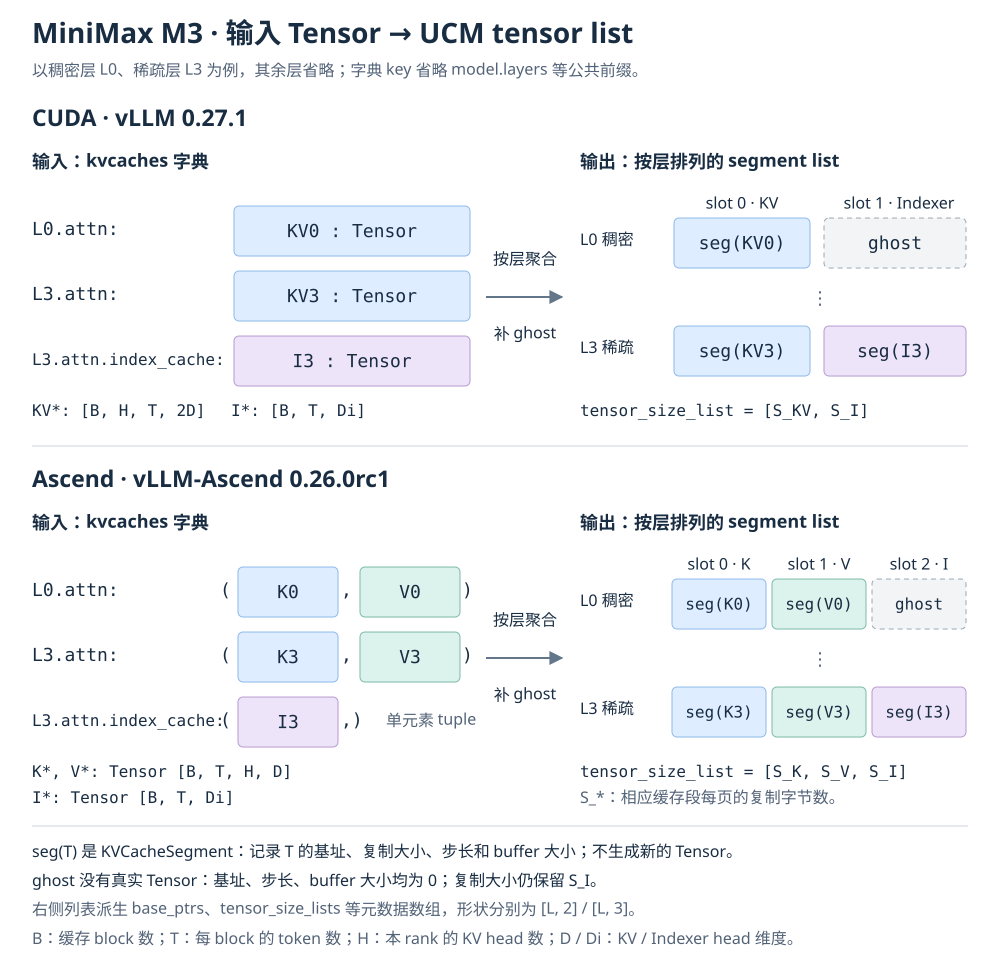

# MiniMax M3 的 UCM 适配

基于 `feat-minimax-m3` 分支、提交 `333a16a`，更新于 2026-09-15。

## 适配方式

M3 的稀疏注意力层除了 Attention KV cache，还维护独立的 Indexer cache；
二者必须一起保存和恢复。模型配置见 [MiniMax-M3 config.json](https://huggingface.co/MiniMaxAI/MiniMax-M3/blob/main/config.json)。

- **统一缓存布局**：新增 `MiniMaxM3KVCacheLayout`，按 transformer 层号聚合
  Attention 和 Indexer 条目，通过路径中的 `index_cache` 区分缓存角色。
  CUDA 每层使用 `[合并的 KV, Indexer]`，Ascend 使用 `[K, V, Indexer]`。
- **补齐稠密层的空位**：没有 Indexer 的稠密层使用空指针、零步长的占位段，
  保持 layerwise 元数据为统一的 `[层, 段]` 矩阵；direct 模式只保留真实段。
  缓存按 block-first、页间无额外 padding 的布局计算地址和复制大小。
- **补齐稀疏层传输回调**：Ascend 包装 `MiniMaxM3SparseAttention._run_sparse_attention`；
  CUDA 包装 `MiniMaxM3SparseAttention.forward`，确保先等待缓存加载，再执行原始计算，
  最后保存整层缓存。不能只给 Indexer 加回调，否则可能遗漏主 KV 或保存时机过早。
- **复用现有机制**：稠密层沿用标准 Attention 的回调，缓存 I/O 和同步复用现有 UCM
  流程；不修改模型计算，也不强制更改用户的 graph mode。合并 develop 后包含
  runtime device ID 修复，避免 DP 场景把 `local_rank` 错当成实际设备编号。

调用顺序：`wait_for_layer_load → 更新 KV 和 Indexer、执行注意力 → save_kv_layer`。

### 传入的 Tensor 与 UCM tensor list

左侧是 `register_kv_caches` 收到的字典：CUDA 的 Attention / Indexer 值分别是
单个 Tensor；Ascend 的值分别是 `(K, V)` 和 `(Indexer,)`。同一稀疏层的
Attention 与 Indexer 是两个字典条目，UCM 按层号将它们合并到同一行。

右侧的 tensor list 是按层构建的 `KVCacheSegment` 列表，不是拼接后的新 Tensor。
它派生出 `[L, 2]`（CUDA）或 `[L, 3]`（Ascend）的 `base_ptrs`、`tensor_size_lists`、
`block_stride_lists` 和 `buffer_sizes`。其中 `tensor_size_list`（单数）取第一行的
复制大小，作为所有层共享的段大小列表；ghost 保留 Indexer 的大小，但没有真实 Tensor。
direct 模式会去掉 ghost 后展平真实段。图示 shape 为逻辑维度，不表达物理地址排列。

## 适用版本与边界

下表是已核对的源码接口基线，不代表所有版本、硬件和图模式都完成了端到端验证。

| 后端 | 适配基线 | 当前补丁的启用条件 |
| --- | --- | --- |
| CUDA | vLLM **0.27.1** | 导入 `vllm.models.minimax_m3.nvidia.model` 时包装 `MiniMaxM3SparseAttention.forward`；没有硬编码的版本上下限。已核对 [v0.27.1 源码](https://github.com/vllm-project/vllm/blob/v0.27.1/vllm/models/minimax_m3/nvidia/model.py)。 |
| Ascend | vLLM **0.26.0** + vLLM-Ascend **0.26.0rc1** | 归一化并对齐后的补丁选择版本 **>= 0.26** 时注册；目标接口为 `vllm_ascend.models.minimax_m3.minimax_m3` 中的 `_run_sparse_attention`。已核对 [v0.26.0rc1 源码](https://github.com/vllm-project/vllm-ascend/blob/v0.26.0rc1/vllm_ascend/models/minimax_m3/minimax_m3.py)。 |

- 版本判断会去掉 `rc`、`.post`、`.dev` 和 `+build` 后缀。检测到 vLLM-Ascend
  且其版本与 vLLM 不一致时，以 **vLLM 版本**选择补丁；这不等于允许任意混装版本。
- Ascend 的后续版本会继续命中上述范围判断，但仍要求模块路径、方法和缓存布局兼容。
  CUDA 的后续版本同样需要核对这些接口，不能直接宣称“所有更高版本均支持”。
- 布局代码兼容 CUDA 的 block-first 4D 和旧式 `[num_blocks, 2, ...]` 5D KV tensor；
  **布局兼容不等于旧版 vLLM 的 layerwise hooks 已完整适配**。

## 启用与验证

启动前设置 `ENABLE_UCM_PATCH=1`，并在已有 UCM 配置中设置 `use_layerwise: true`。
补丁在目标模型模块导入时生效；没有 KV transfer 上下文或处于内存 profiling 阶段时，
不执行额外传输回调。若目标类或方法缺失，补丁会明确报兼容性错误。

当前 CPU 单测 **156 项通过，另有 2 项子测试通过**，覆盖缓存布局、空位处理、
稠密/稀疏层加载链、回调顺序、版本路由和 graph 配置保持。
这些结果不等同于 CUDA/NPU 实机推理、完整图执行或性能验证。

主要代码入口：

- [缓存布局与 connector](../ucm/integration/vllm/ucm_connector.py)
- [Ascend hooks](../ucm/integration/vllm/patch/v0260/vllm_ascend/minimax_m3_kv_transfer_patch.py)
- [CUDA hooks](../ucm/integration/vllm/patch/v0271/vllm/minimax_m3_kv_transfer_patch.py)
- [版本选择与补丁注册](../ucm/integration/vllm/patch/apply_patch.py)
