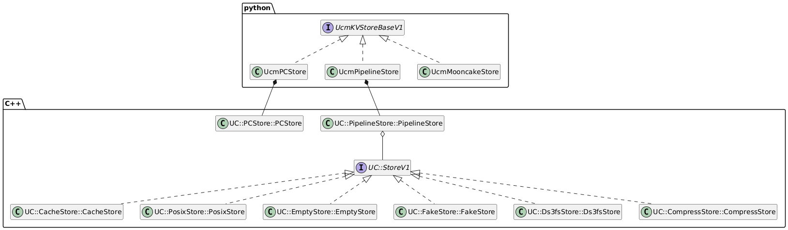

# Extending UCM Store

## 📖 Overview

In the Unified Cache Manager (UCM) architecture, the **Store component** handles:

- **Space Management**: Allocation and scaling of KV Cache storage
- **Persistence**: Durable storage and recovery of KV Cache data
- **Tiered Transfer**: Efficient data movement between storage hierarchies
- **Data Processing**: Quantization, compression, and encoding transformations

### Built-in Store Ecosystem

UCM provides production-ready Store implementations with the following dependency architecture:



### Extension Options

Beyond built-in Stores, UCM supports three extension patterns:

|        Method         | Implementation |  Performance  |                   Use Case                    |    Rating     |   Reference Implementation   |
| --------------------- | -------------- | ------------- | --------------------------------------------- | ------------- | ---------------------------- |
| **Pure Python**       | Python only    | ⭐⭐⭐☆☆   | Prototyping, algorithm validation             | ⭐⭐         | `UcmMooncakeStore`           |
| **Python/C++ Hybrid** | Python + C++   | ⭐⭐⭐⭐☆  | Complex logic with performance-critical paths | ⭐⭐⭐       | `UcmPCStore`                 |
| **Pure C++**          | C++ only       | ⭐⭐⭐⭐⭐ | Production, high-performance scenarios        | ⭐⭐⭐⭐⭐ | `UC::CacheStore::CacheStore` |

---

## 🔧 Pure Python Extension

For rapid prototyping and algorithm validation where development speed outweighs runtime performance.

### Implementation Steps

1. **Inherit the base class**
   ```python
   from ucm.store.ucmstore_v1 import Task, UcmKVStoreBaseV1

   class UcmCustomPythonStore(UcmKVStoreBaseV1):
       def __init__(self, config: dict):
           super().__init__(config)
   ```

2. **Implement required methods**
   ```python
    @abstractmethod
    def lookup(self, block_ids: List[bytes]) -> List[bool]:
        """Check presence of blocks in external storage."""
        pass
    @abstractmethod
    def lookup_on_prefix(self, block_ids: List[bytes]) -> int:
        """Check presence of blocks in external storage."""
        pass
    @abstractmethod
    def prefetch(self, block_ids: List[bytes]) -> None:
        """Asynchronously prefetch blocks into high-speed cache."""
        pass
    @abstractmethod
    def load(self, block_ids: List[bytes], shard_index: List[int], dst_tensor: List[List[torch.Tensor]]) -> Task:
        """Initiate transfer of KV cache from storage to device."""
        pass
    @abstractmethod
    def dump(self, block_ids: List[bytes], shard_index: List[int], src_tensor: List[List[torch.Tensor]]) -> Task:
        """Initiate transfer of KV cache from device to storage."""
        pass
    @abstractmethod
    def load_data(self, block_ids: List[bytes], shard_index: List[int], dst_addr: List[List[int]] | np.ndarray) -> Task:
        """Low-level fetch: copy KV data to device pointers."""
        pass
    @abstractmethod
    def dump_data(self, block_ids: List[bytes], shard_index: List[int], src_addr: List[List[int]] | np.ndarray) -> Task:
        """Low-level dump: copy KV data from device pointers."""
        pass
    @abstractmethod
    def wait(self, task: Task) -> None:
        """Block until the given transfer task completes."""
        pass
    @abstractmethod
    def check(self, task: Task) -> bool:
        """Non-blocking poll for task completion."""
        pass
   ```

   > **Note**: Full interface specifications are in [`ucm/store/ucmstore_v1.py`](https://github.com/ModelEngine-Group/unified-cache-management/blob/develop/ucm/store/ucmstore_v1.py)

3. **Register your Store**
   ```python
   # ucm/store/factory_v1.py
   UcmConnectorFactoryV1.register_connector(
       "UcmCustomPythonStore",
       "ucm.store.custom.connector",
       "UcmCustomPythonStore"
   )
   ```

> ⚠️ **Performance Warning**: Python implementations are GIL-bound and unsuitable for high-throughput scenarios. Use only for development and testing.

---

## ⚡ Hybrid Python/C++ Extension

Best for balancing productivity with performance—implement hot paths in C++, orchestrate with Python.

### Architecture
```
┌─────────────────────────┐
│  Python Wrapper Layer   │  ← Business logic, config, API surface
│    (ucm/store/cpy/*)    │
└────────────┬────────────┘
             │ pybind11
             ▼
┌─────────────────────────┐
│    C++ Core Layer       │  ← Performance-critical operations
│    (ucm/store/cc/*)     │    Memory management, compute kernels
└─────────────────────────┘
```

### Implementation Steps

1. **Implement C++ core** (`hybrid_store.cc`)
   ```cpp
   #include "ucm/store/ucmstore_v1.h"

   namespace UC::HybridStore {

   class HybridStore : public StoreV1 {
   public:
       ~HybridStore() override;
       Status Setup(const Detail::Dictionary& config) override;
       std::string Readme() const override;

       // Core operations
       Expected<std::vector<uint8_t>> Lookup(const Detail::BlockId* blocks, size_t num) override;
       Expected<ssize_t> LookupOnPrefix(const Detail::BlockId* blocks, size_t num) override;
       void Prefetch(const Detail::BlockId* blocks, size_t num) override;
       Expected<Detail::TaskHandle> Load(Detail::TaskDesc task) override;
       Expected<Detail::TaskHandle> Dump(Detail::TaskDesc task) override;
       Expected<bool> Check(Detail::TaskHandle taskId) override;
       Status Wait(Detail::TaskHandle taskId) override;
   };

   }  // namespace UC::HybridStore
   ```

   > **Note**: Full interface specifications are in [`ucm/store/ucmstore_v1.h`](https://github.com/ModelEngine-Group/unified-cache-management/blob/develop/ucm/store/ucmstore_v1.h)

2. **Create Python bindings** (`hybrid_store.cpy.cc`)
   ```cpp
   #include <pybind11/pybind11.h>

   PYBIND11_MODULE(ucmhybridstore, m) {
       py::class_<UC::HybridStore::HybridStore>(m, "HybridStore")
           .def(py::init<const Config&>())
           .def("Lookup", &UC::HybridStore::HybridStore::Lookup, py::arg("blocks_ids").noconvert())
           .def("Load", &UC::HybridStore::HybridStore::Load)
           ...; // other interface
   }
   ```

3. **Python wrapper layer**
   ```python
   from ucmhybridstore import HybridStore

   class UcmHybridStoreWrapper:
       def __init__(self, config: dict):
           self._store = HybridStore(config)

       def lookup_with_retry(self, block_ids):
           """Add Python-level retry logic"""
           result = self._store.Lookup(block_ids)
           if not result:
               result = self._handle_miss(block_ids)
           return result
   ```

---

## 🚀 Pure C++ Extension (Recommended)

Production-ready implementation with maximum performance and resource control.

### Why C++?

- **Zero-overhead abstraction**: Direct memory access, no Python runtime overhead
- **Full resource control**: Explicit memory management and threading
- **Seamless integration**: Stackable and chainable with built-in Stores

### Implementation Steps

1. **Define header** (`custom_store.h`)
   ```cpp
   #pragma once
   #include "ucm/store/ucmstore_v1.h"

   namespace UC::CustomStore {

   class CustomStore : public StoreV1 {
   public:
       ~CustomStore() override;
       Status Setup(const Detail::Dictionary& config) override;
       std::string Readme() const override;

       // Required interfaces
       Expected<std::vector<uint8_t>> Lookup(const Detail::BlockId* blocks, size_t num) override;
       Expected<ssize_t> LookupOnPrefix(const Detail::BlockId* blocks, size_t num) override;
       void Prefetch(const Detail::BlockId* blocks, size_t num) override;
       Expected<Detail::TaskHandle> Load(Detail::TaskDesc task) override;
       Expected<Detail::TaskHandle> Dump(Detail::TaskDesc task) override;
       Expected<bool> Check(Detail::TaskHandle taskId) override;
       Status Wait(Detail::TaskHandle taskId) override;
   };

   }  // namespace UC::CustomStore
   ```
   > **Note**: Full interface specifications are in [`ucm/store/ucmstore_v1.h`](https://github.com/ModelEngine-Group/unified-cache-management/blob/develop/ucm/store/ucmstore_v1.h)

2. **Expose factory function** (`custom_store.cc`)
   ```cpp
   extern "C" UC::StoreV1* MakeCustomStore() { return new UC::CustomStore::CustomStore(); }
   ```

3. **CMake configuration** (`CMakeLists.txt`)
   ```cmake
   file(GLOB_RECURSE UCM_CUSTOM_STORE_CC_SOURCE_FILES "./cc/*.cc")
   add_library(customstore SHARED ${UCM_CUSTOM_STORE_CC_SOURCE_FILES})
   target_include_directories(customstore PUBLIC ${CMAKE_CURRENT_SOURCE_DIR}/cc)
   target_link_libraries(customstore PUBLIC storeintf)

   file(RELATIVE_PATH INSTALL_REL_PATH ${CMAKE_SOURCE_DIR} ${CMAKE_CURRENT_SOURCE_DIR})
   install(TARGETS customstore LIBRARY DESTINATION ${INSTALL_REL_PATH} COMPONENT ucm)
   ```

4. **Dynamic registration** (`custom_store.py`)
   ```python
   from ucm.store.pipeline.connector import UcmPipelineStoreBuilder

   def _custom_pipeline_builder(config: Dict[str, object], pipeline: ucmpipelinestore.PipelineStore):
       pipeline.Stack("Custom", str("custom/libcustomstore.so"), config)

   UcmPipelineStoreBuilder.register("Custom", _custom_pipeline_builder)
   ```

5. **YAML configuration**
   ```yaml
   ucm_connectors:
     - ucm_connector_name: "UcmPipelineStore"
       ucm_connector_config:
         store_pipeline: "Custom"
         # ... custom config
   ```

### Best Practices

- ✅ **Memory Management**: Use UCM smart pointers and memory pools—avoid raw `new`/`delete`
- ✅ **Exception Safety**: Return `UC::Status` objects instead of throwing exceptions
- ✅ **Thread Safety**: Implementations must be thread-safe; UCM calls from multiple threads concurrently
- ✅ **Performance**: Annotate hot paths with `UCM_PROFILER_SCOPE`

---

## 🎯 Quick Decision Guide

**Decision Matrix**

|     Requirement     |  Pure Python  |   Hybrid    |   Pure C++    |
| ------------------- | ------------- | ----------- | ------------- |
| Development speed   | ⭐⭐⭐⭐⭐ | ⭐⭐⭐⭐ | ⭐⭐⭐       |
| Runtime performance | ⭐⭐⭐       | ⭐⭐⭐⭐ | ⭐⭐⭐⭐⭐ |
| Threading support   | ❌            | ⚠️         | ✅            |
| Production ready    | ❌            | ⚠️         | ✅            |

---

## ✅ Pre-implementation Checklist

- [ ] Reviewed [`ucm/store/ucmstore_v1.h`](https://github.com/ModelEngine-Group/unified-cache-management/blob/develop/ucm/store/ucmstore_v1.h)
- [ ] Reviewed [`ucm/store/ucmstore_v1.py`](https://github.com/ModelEngine-Group/unified-cache-management/blob/develop/ucm/store/ucmstore_v1.py)
- [ ] Defined supported data types and compression algorithms
- [ ] Estimated target QPS and latency SLOs
- [ ] Prepared unit tests (reference: [`ucm/store/test/`](https://github.com/ModelEngine-Group/unified-cache-management/tree/develop/ucm/store/test))
- [ ] Selected extension method based on performance requirements
- [ ] Created stub implementation and validated registration

---

## 🤝 Getting Help

- **Issues**: [Report bugs](https://github.com/ModelEngine-Group/unified-cache-management/issues)
- **Examples**: See [`ucm/store/test/e2e`](https://github.com/ModelEngine-Group/unified-cache-management/tree/develop/ucm/store/test/e2e)

---

**Next Steps**: Once your Store is implemented, see [Prefix Cache Guide](https://ucm.readthedocs.io/en/latest/user-guide/prefix-cache/index.html) for pipeline configuration.
