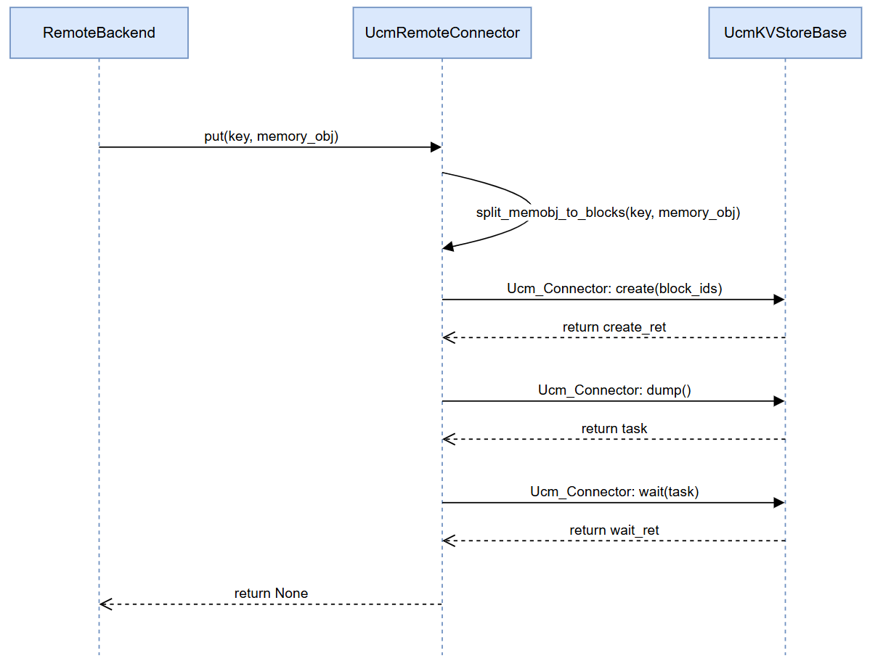
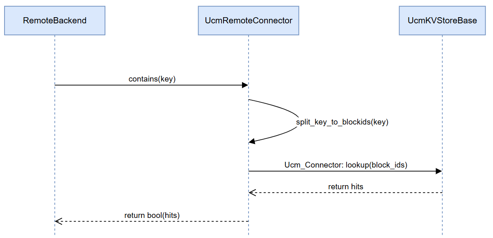
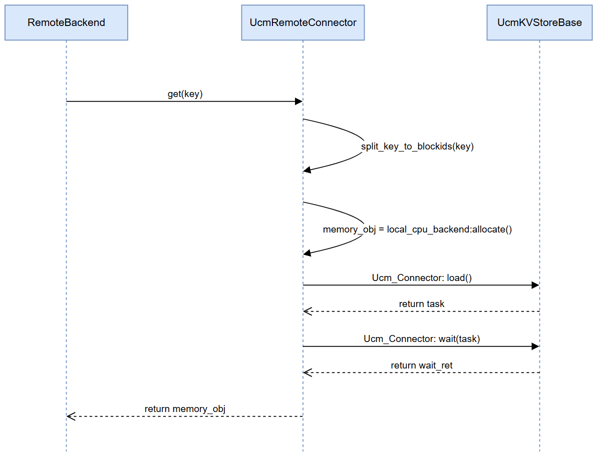

# LMCache 与 UCM KVStore 对接说明

通过实现一个自定义的 `RemoteConnector`，将 UCM 的 KVStorebase 接入lmcache。

## 架构概览

- UCM 支持多种外部 KV 存储后端，接口统一为 `KVStoreBase`。
- 我们通过继承 `RemoteConnector` 实现了 `UcmRemoteConnector`，作为 LMCache 到 `UcmKVStoreBase` 的桥接层。
- `RemoteConnector` 实现了三个核心方法：`put`、`get`、`exists`。

### put:

### contains:

### get:

