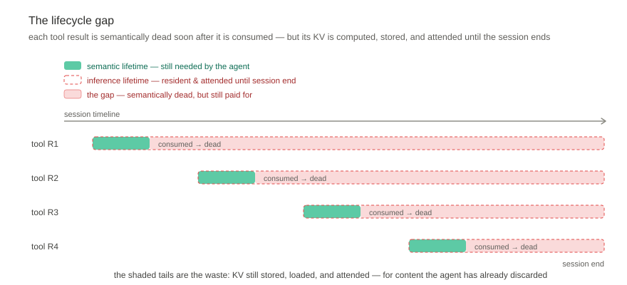
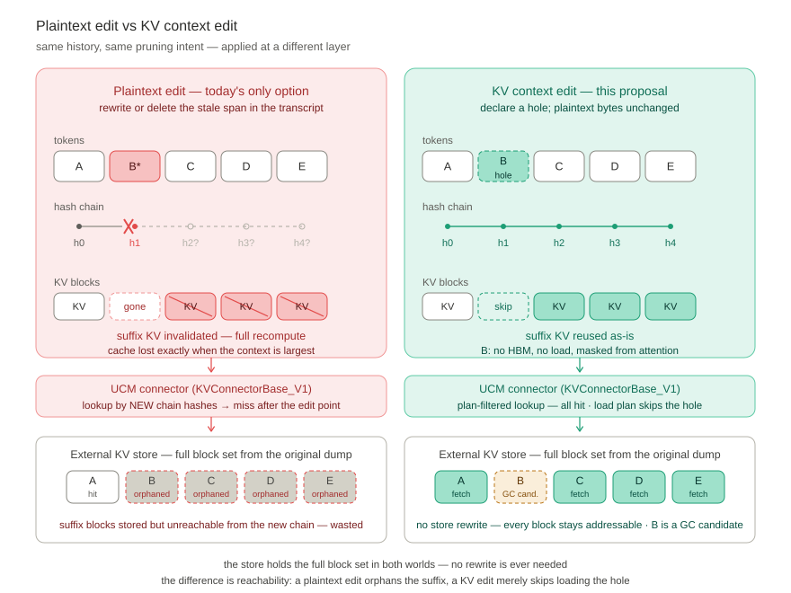
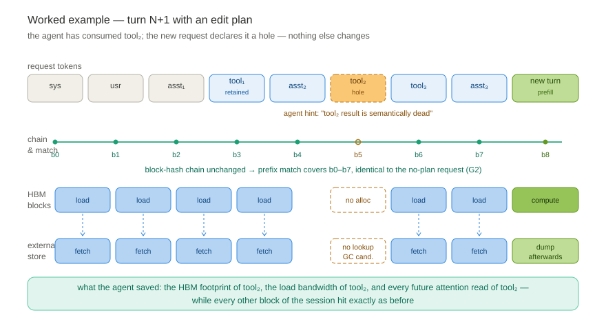
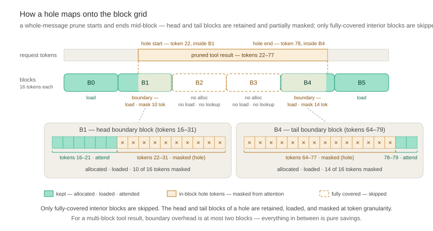

# [KVBridge] KV Context Editing: Relaxed Prefix Alignment for KV Allocation and Reuse

|                                 |                                                                                                                                                         |
| ------------------------------- | ------------------------------------------------------------------------------------------------------------------------------------------------------- |
| **Status**                      | Draft v2 — design doc / feature proposal                                                                                                                |
| **Component**                   | UCM core, UCM↔vLLM/SGLang integration, external KV store                                                                                                |
| **Suggested in-repo placement** | `docs/source/user-guide/kv-context-editing/index.md` (register in the toctree of `docs/source/user-guide/index.md`); engineering tracking issue in the main repo |

---

## 🚀 Summary

**Key problem.** Agent behavior and design are boxed in by the strict  
prefix-alignment constraint. An agent cannot drop parts of its history in a  
timely manner — even after they have become semantically stale, such as  
consumed tool results — because touching them at the plaintext layer  
invalidates the KV of the entire suffix that follows, forcing a full recompute  
of everything after the edit.

We therefore propose **KV Context Editing**: a native, request-scoped interface through  
which an agent tells the serving stack that certain context ranges — typically  
stale tool results — are semantically dead. The stack then:

1. **Keeps prefix matching at maximum length.** The request plaintext stays  
   byte-stable, so the block-hash chain — and therefore prefix-cache reuse — is  
   unaffected by the edit.
2. **Stops allocating HBM for the dead ranges.** Blocks fully covered by an  
   edit receive no HBM allocation, are not loaded from external storage, and do  
   not donate keys/values to any subsequent attention computation.
3. **Loads and reuses the KV after the dead ranges as usual.** The suffix that  
   follows an edited region is fetched, resident, and attended to exactly as it  
   is today.

In other words: the agent stops *paying* for context it has semantically  
discarded, without losing the cache reuse of everything it kept. The edit  
happens at the KV layer, not the plaintext layer — which is the only layer at  
which an edit does not destroy the suffix.

---

## 🧭 Background & Motivation

### The lifecycle gap

Agentic sessions are dominated by tool results. A coding agent reads files,  
runs tests, greps logs; a search agent retrieves pages; a data agent pulls  
query outputs. These tool results routinely form the overwhelming majority of  
the context (tens to hundreds of KB per turn), yet each individual result has a  
short *semantic* lifetime: once the agent has acted on a file read or a test  
run, that payload is — from the agent's perspective — inert.

The serving stack, however, assigns every token the same *inference* lifetime:  
as long as the session's prefix is alive, the KV of every token in it is  
computed, resident in HBM (or fetched back from external storage), and attended  
over by every subsequent query.



The gap is structural: semantic staleness is per-fragment, but inference  
lifetime is per-session — the stack has no mechanism to let one decay without  
the other.

### Why current stacks cannot prune

The blocker is the coupling between plaintext and KV validity. Causal attention  
makes the KV of position *i* a function of tokens `[0, i]`. Every mainstream  
reuse mechanism — vLLM prefix caching, UCM's store, SGLang's radix cache —  
exploits this by content-addressing blocks along the prefix chain:  
`h(A) = hash(ROOT, A)`, `h(AB) = hash(h(A), B)`, `h(ABC) = hash(h(AB), C)`.

The consequence: **you may not change a single byte of history without  
invalidating the KV of everything after it.** An agent that prunes a stale tool  
result at the plaintext level — deleting it, replacing it with a placeholder,  
or summarizing it — breaks the chain at the edit point and forfeits all  
downstream reuse:



This is not a corner case. Anthropic's production **context editing** feature  
(`clear_tool_uses_20250919`) replaces stale tool results with placeholder text  
precisely because the plaintext is the only surface their API can edit — and  
their own documentation states the cost: *"Tool result clearing: Invalidates  
cached prompt prefixes when content is cleared."* The same documentation  
advises clearing *at least* a minimum number of tokens per edit so that the  
cache-invalidation is "worthwhile." On hosted APIs this is a billing trade-off.  
On self-hosted vLLM/SGLang it is worse: it is a full prefill of the entire  
suffix, on hardware you own, at exactly the moment (context growth) when the  
system is most stressed.

So today the agent developer has only bad options:

| Option                            | Semantic cleanliness    | Cache/reuse                  | Compute & memory           |
| --------------------------------- | ----------------------- | ---------------------------- | -------------------------- |
| Keep stale tool results           | ✗ degrades with context | ✓ full prefix reuse          | ✗ pays forever             |
| Delete/replace at plaintext       | ✓                       | ✗ suffix chain destroyed     | ✗ full suffix recompute    |
| Periodic compaction/summarization | ✓ (lossy)               | ✗ rewrites the middle        | ✗ worse than deletion      |
| **KV context editing (this doc)** | ✓                       | ✓ max-length prefix + suffix | ✓ dead ranges cost nothing |

### Related efforts and why they do not cover this

- **Anthropic context editing** — establishes the agent-side demand (their  
  evals: 29% task improvement from clearing alone, 84% token reduction on a  
  100-turn search agent) but operates at the plaintext layer and accepts prefix  
  invalidation.
- **vLLM RFC #37003 (Context-Aware KV-Cache Retention)** — per-range  
  *eviction priority* for HBM blocks. Orthogonal: it decides *which blocks to  
  evict first* under pressure; it does not stop dead blocks from participating  
  in attention while resident, and it does not preserve suffix reuse across an  
  edit. Complementary — retention directives protect what matters; edit  
  directives stop paying for what doesn't.
- **vLLM RFC #51428 (Programmatic Session-Aware KV Cache Management)** —  
  router-initiated session hints (retain/evict/migrate). Same eviction-centric  
  axis; no participation or alignment semantics.
- **KV compression / sparse attention (UCM sparse family: ESA, GSA, …)** —  
  algorithmic selection of *which* KV to attend. Complementary: they infer  
  importance from the tensor side; KV context editing gets ground truth from  
  the agent side. The two compose (see  
  [Interactions with existing UCM features](#-interactions-with-existing-ucm-features)).

The missing piece across all of the above: **no serving stack lets the agent  
express semantic invalidation of context without destroying the KV of the  
context that follows it.** That is the interface UCM proposes to own.

---

## 🎯 Goals / Non-Goals

**Goals**

- G1 — A request-scoped **edit interface** (hint payload) that any agent  
  framework can attach to a normal chat/completion request, carrying the  
  semantic lifecycle information only the agent has.
- G2 — **Zero disturbance to prefix matching**: plaintext stays byte-stable;  
  block-hash chains and max-length prefix reuse are preserved exactly.
- G3 — **Allocation-level enforcement**: fully-edited ranges receive no HBM  
  blocks, are never fetched from external storage, and contribute no keys or  
  values to any later attention.
- G4 — **Suffix reuse**: KV after an edited range is loaded and used as stored.
- G5 — **Store-level lifecycle**: edits propagate to the external store —  
  edited blocks stop being dumped, become GC candidates, and cannot be  
  resurrected by stale lookups.
- G6 — **Incremental deployability**: the feature must be demonstrable through  
  the UCM patch layer before any upstream vLLM change lands.

**Non-Goals**

- NG1 — No plaintext rewriting, token deletion, or position renumbering. The  
  model still *reads* the full transcript; we only stop *storing and attending*  
  the dead parts. (Position stability is what makes suffix reuse possible.)
- NG2 — No new eviction policy. Retention/eviction priorities remain whatever  
  the engine + UCM already do.
- NG3 — No training-time or model-architecture changes; no fine-tuning to  
  "repair" edits.
- NG4 — v1 does not target linear-attention / hybrid state-space layers (see  
  Open Questions).
- NG5 — Not an agent-side summarization/memory product. UCM provides the KV  
  primitive; compaction policies are consumer-side concerns.

---

## 🔧 Proposed Semantics: The Edit Contract

### The contract

Let the rendered prompt be tokens `t[0..n)` with block-hash chain computed as  
today. A request may carry an **Edit Plan**: a set of message-space entries  
(see the interface below) declaring certain context semantically invalid. The  
server resolves them into a set of disjoint token ranges  
`H = {[s₁,e₁), …, [sₖ,eₖ)}` (the **holes**) during prompt construction. The  
serving stack guarantees:

1. **Byte-stable plaintext.** Tokenization, prompt bytes, and the block-hash  
   chain are identical to a request without the plan. Prefix matching runs to  
   maximum matched length, unchanged. (G2)
2. **No position shift.** Tokens after a hole keep their absolute positions and  
   RoPE phases. We do *not* compact the sequence. This is a deliberate  
   divergence from "true deletion": renumbering would invalidate every  
   downstream block, which is exactly what we are avoiding.
3. **Participation mask.** For every query at position `q > s₁` (i.e., every  
   position at or after the first hole), attention over key/value positions  
   inside any hole is masked out — at every layer, for both prefill of new  
   tokens and every decode step. (G3, the "does not participate in subsequent  
   computation" rule)
4. **No allocation, no load — for fully covered blocks.** Blocks fully  
   covered by holes get no HBM allocation, are excluded from the UCM load  
   plan, and are skipped by store lookup. Because a pruned span almost never  
   aligns to block boundaries (e.g., pruning a whole tool output starts and  
   ends mid-block), the **boundary blocks** at the head and tail of a hole are  
   the exception: they are retained — allocated and loaded like any other  
   block — and masked at token granularity so that only the hole's tokens  
   inside them are excluded from attention. (G3)
5. **Suffix reuse, as stored.** Blocks after the first hole are loaded and used  
   exactly as stored; the approximation is confined to the masked-attention  
   semantics defined below. (G4)

The mental model for users: **the model is served as if it had been told  
"ignore these spans"** — an attention-mask-level edit, not a text edit.

### The request interface

Agent-facing surface (vLLM OpenAI-compatible server via `extra_body`; offline  
engine via the equivalent request field; SGLang via its own extra-params path —  
same schema).

The interface is deliberately expressed in **message space, not token space**:  
the agent owns the payload (the `messages` list) and its text; token IDs only  
exist after the server renders the prompt, so the agent can never reliably  
address token ranges. The server resolves the plan to token ranges during  
prompt construction — at exactly the point where both the text and the  
tokenizer are available.

Two granularities are offered:

**Coarse-grained — whole messages.** The agent prunes whole messages by  
**global index** — the absolute position in this request's `messages` list, in  
which system, user, assistant, and tool messages are interleaved — asserting  
each message's role via `type`:

```jsonc
{
  "messages": [ /* full, unmodified history — byte-stable across turns */ ],
    
  }
}
```

**Fine-grained — character spans within one message.** When only part of a  
message is dead (e.g., the file body of a large tool result whose header is  
still useful), the agent narrows the hole to `[start, end)` character offsets  
in that message's text — mixing freely with coarse entries in the same plan:

```jsonc
"prune": {
  "messages": [
    { "type": "tool", "indices": [4, 7] },
    {
      "type": "tool",
      "index": 7,                                    // global index, one message
      "spans": [ { "start": 410, "end": 9800 } ]     // char ranges in its text
    }
  ]
}
```

Semantics:

- `indices` / `index` are **global**: they address the request's `messages`  
  list directly — the same interleaved list (system / user / assistant / tool)  
  the agent already owns and assembles. There is no per-type numbering.
- `type` (`"tool"` | `"assistant"`) is a **role assertion**, not a selector:  
  the server verifies that every indexed message actually has that role and  
  rejects the plan on mismatch — a cheap guard against off-by-one drift when  
  the agent reassembles its history. It also enforces the v1 whitelist:  
  system and user messages are not prunable.
- Coarse and fine entries compose freely in one plan; overlapping holes are  
  merged server-side. A fine-grained entry on a message index that is also  
  coarsely pruned is redundant (the whole message is already a hole).
- The plan is **cumulative per request**, not a diff against server state:  
  the server stays stateless, exactly as prompt-based caching is stateless  
  today. Idempotency: two requests with identical `(prompt, plan)` are  
  indistinguishable.
- Guardrails: the final (generation-target) assistant message is never  
  prunable; the total hole ratio is capped by config (default 90%) to refuse  
  degenerate plans; out-of-range indices / spans, or a `type` that mismatches  
  the indexed message's actual role, are rejected with a 4xx, not  
  silently ignored.
- The server resolves each entry against the rendered prompt during prompt  
  construction: message → chat-template segment → character span → token  
  range. Resolution happens before hashing, so **holes never affect the  
  block-hash chain** (G2) — the resolved ranges are consumed only by the  
  allocation plan and the participation mask.

### Worked example



Walked through in words:

- Turn N request: `[sys][usr][asst₁][tool₁][asst₂][tool₂][tool₃][asst₃]` → dump all blocks to the store.
- Turn N+1 request (agent has consumed `tool₂`, declares it dead by appending  
  `[new usr]` and attaching the plan):
  - **plaintext:** `[sys][usr][asst₁][tool₁][asst₂][tool₂][tool₃][asst₃][new usr]` — `tool₂` span marked as a hole;
  - **hash chain:** `h₀ … h₇` identical to turn N — the plan is not hash input;
  - **prefix match:** full match on blocks 0–7 (G2: max-length match kept);
  - **load plan:** blocks 0–3 and 6–7 fetched from the store; hole blocks 4–5 skipped (G3);
  - **HBM allocation:** no blocks for 4–5; boundary token masks if the hole is unaligned;
  - **attention:** queries in `[new usr]` and all decode steps skip hole positions;
  - **store GC:** blocks 4–5 become reclaim candidates for this session's chain.

The agent saved: the HBM footprint of `tool₂`, the load bandwidth of `tool₂`,  
and every future attention read of `tool₂` — while every other block of the  
session hit exactly as before.

---

## ⚙️ Engine-Side Execution

This section describes behavior; the *division of labor* between vLLM core and  
the UCM connector (KVConnectorBase_V1 hooks) is deliberately deferred to the  
upstream vLLM RFC — UCM's patch layer can prototype all of it today, but  
landing it properly requires upstream scheduler and attention-metadata support.

### 1. Prefix matching stays max-length

The edit plan never participates in hash computation for the *prefix chain  
itself*. `RequestHasher` continues to derive block IDs exactly as now  
(content-addressed, chained). The plan is carried alongside the request as  
allocation-time metadata, not hash-time input. Consequently:

- Matched-prefix length with edits == matched-prefix length without edits.
- Requests with different plans but the same plaintext share blocks  
  identically — the plan is not hash input, so block sharing is unaffected by  
  edits.

### 2. Allocation skips holes

The scheduler builds an **allocation plan** from the request's edit metadata  
before HBM allocation:

- Blocks fully inside a hole: **zero** physical blocks allocated. The block  
  table simply has no entry for them — paged-attention kernels iterate the  
  block table, so absence is enforcement, not a convention.
- Blocks straddling a hole boundary: allocated normally, with the hole's token  
  range recorded in a per-request **participation mask** consumed by attention  
  metadata construction.
- This is where HBM savings materialize: capacity freed for concurrent  
  sessions / longer contexts, identical to offloading the blocks — but with  
  zero load-back cost, because the content is never coming back.

A whole-message prune lands mid-block at both ends in practice: the hole's  
first and last tokens sit inside otherwise-live blocks. The head and tail  
**boundary blocks are therefore retained** — allocated, loaded, and shared  
exactly as if there were no edit — while the fully covered interior blocks  
are skipped entirely:



The cost model follows directly: for a pruned span of *k* blocks (16 tokens  
each in this example), *k − 2* interior blocks are pure savings — no HBM, no  
lookup, no load — and the two boundary blocks pay their normal price minus  
the masked tokens. Boundary overhead is bounded at **at most two blocks per  
hole**, so a multi-block tool result is almost all savings; single-block  
holes (small spans) may save nothing and are simply a no-op on the allocation  
axis while still masked from attention.

### 3. Attention participation

- Full-hole blocks: enforced by block-table omission (no kernel changes  
  needed for the common case — this is a strategic implementation choice).
- Token-granular holes within boundary blocks: masked via the attention  
  metadata (the same compute-mask machinery UCM's sparse modules already  
  use to exclude tokens from attention kernels).
- Applies uniformly to: prefill of new suffix tokens, chunked-prefill steps,  
  and every decode step. Backend support matrix (FA2/FA3 varlen, FlashInfer,  
  Triton paged attention, Ascend) is tracked in the upstream RFC; block-table  
  omission covers the dominant case on all paged backends.

### 4. Suffix loads and runs as usual

The UCM connector's load path (lookup → async load → layer-wise overlap)  
proceeds unchanged, with the load plan filtered by the allocation plan: fully  
covered hole blocks are not looked up, not fetched, not staged. Boundary  
blocks and everything after the hole are fetched, made resident, and attended  
to — the "suffix KV loads and infers normally" guarantee.

---

## 🗄️ Reuse Semantics

The subtle question: *is the stored suffix KV still valid to reuse, given it  
was computed when the hole tokens were visible?* The KV of a suffix token  
encodes (through earlier layers' attention) information from the entire  
prefix, including the now-dead region. Our answer: **reuse it as stored**, and  
make the approximation explicit.

Reuse suffix KV exactly as stored — it was computed under full attention,  
which is a *superset* of the masked view. Future queries are masked from the  
holes, so they never directly read hole positions; what does leak is the  
second-order information the suffix representations absorbed from the holes  
while they were visible.

- **Cost model:** an edit costs *nothing* — no recompute anywhere, ever. Pure  
  win in HBM, bandwidth, and FLOPs.
- **Accuracy model:** the deviation from "reference full recompute with mask"  
  is bounded by the influence of hole tokens on suffix hidden states. For  
  semantically dead tool payloads this influence is expected to be small —  
  Anthropic's production clearing, which removes such information *entirely*,  
  shows measurable task *gains* — and we validate empirically (see  
  Evaluation).
- **Hash space:** all blocks, before and after holes, remain in the **vanilla  
  hash space**. A request carrying a plan shares blocks with no-edit requests  
  transparently. Maximum reuse, zero namespace pollution.

### Store lifecycle: dump / lookup / load / GC

The external store is a first-class citizen of this design, not an  
afterthought:

- **Dump.** Edited blocks are not written. A dump of the session writes only  
  blocks in the load plan — external storage footprint shrinks in lockstep  
  with HBM.
- **Lookup.** Store lookups are filtered by the allocation plan before I/O is  
  issued; hole ranges generate no requests.
- **GC-on-edit.** An edit plan doubles as a store GC directive: for the  
  requesting session's chain, hole blocks are logically punched out and become  
  reclaim candidates. Physical reclamation respects content-addressing  
  refcounts (other sessions with the same plaintext chain may still reference  
  the blocks), so GC removes the *chain association* immediately and the  
  *bytes* when the last reference drops. This is a capability HBM-only engines  
  structurally cannot offer: UCM can actually return the space to the storage  
  tier the moment the agent declares the content dead.
- **No stale resurrection.** Hole ranges generate no lookups and their chain  
  association is removed by GC-on-edit, so a lookup can never silently fetch  
  KV that the plan declared dead.

---

## 🏗️ UCM Architecture Changes

| Component                         | Change                                                                                                                                                                                                                                                                                                   |
| --------------------------------- | -------------------------------------------------------------------------------------------------------------------------------------------------------------------------------------------------------------------------------------------------------------------------------------------------------- |
| `RequestHasher`                   | Unchanged — the plan never participates in hash computation; chains are identical with or without edits.                                                                                                                                                                                                 |
| New `EditPlanManager`             | Parses/validates `kv_edit` (coarse + fine entries, merge, dedup, guardrails); resolves message-space entries to token ranges during prompt construction; produces the **allocation plan** (block-level skip + token-level mask) and the **load plan** filter; exposes them to connector and patch hooks. |
| `KVStoreConnector` / store layer  | Plan-filtered lookup/load; plan-filtered dump; GC-on-edit directive with refcount-aware reclaim.                                                                                                                                                                                                         |
| Sparse compute-mask path          | Token-granular participation masks for boundary blocks ride the existing mask machinery (`UcmSparseBase` hooks in scheduler + layer forward).                                                                                                                                                            |
| `UCMConnector` (Direct/LayerWise) | Thread the allocation/load plan through `get_num_new_matched_tokens` / async load / save lifecycle.                                                                                                                                                                                                      |
| Config surface                    | `ucm_edit_config: { enabled, max_hole_ratio, gc_on_edit }` under `kv_connector_extra_config`; off by default — zero overhead when unused.                                                                                                                                                                |
| Observability                     | New metrics (below) wired into the existing Prometheus logger; edit plans visible in UCM trace mode.                                                                                                                                                                                                     |

Nothing here requires new storage backends: `KVStoreBase` implementations  
(NFSStore and friends) inherit the feature through the connector layer, since  
the store continues to see plain content-addressed block IDs.

---

## 🔗 Interactions with Existing UCM Features

- **Prefix cache** — strictly additive; chains and eviction untouched. An  
  edit plan never reduces matched length (G2) and never affects other  
  sessions' hits.
- **Sparse attention (ESA/GSA/…)** — orthogonal and complementary: sparse  
  algorithms decide attention participation from tensor statistics; the edit  
  plan decides it from agent ground truth. The participation masks compose  
  (intersection); holes also shrink the candidate set sparse retrieval must  
  consider.
- **PD disaggregation** — the edit plan travels with the request through the  
  connector protocol; the prefill side produces plan-consistent KV (skipping  
  hole allocation), the decode side receives a block table that already omits  
  holes.
- **Prefill offload / window extrapolation (ReRoPE)** — windowed attention is  
  itself a participation restriction; edits simply extend the mask with  
  agent-declared regions.
- **SGLang integration** — the wire schema and store-side semantics are  
  engine-agnostic; SGLang support follows the same patch-layer strategy as  
  existing UCM integrations, after the vLLM path stabilizes.

---

## 🛡️ Correctness, Safety, Quality

- **Determinism.** Identical `(prompt, plan)` → identical masks → identical  
  outputs. No server-side mutable state; re-sending a request is idempotent.
- **Monotonicity.** The recommended agent discipline (holes only grow) keeps  
  plans cumulative, idempotent, and faithful to the fact that consumed results  
  stay consumed. Non-monotonic plans are *allowed* (the contract is  
  per-request) — and because the store is never rewritten, "un-editing" is  
  cheap: the full block set remains addressable, so a later request can simply  
  declare fewer holes.
- **Leakage.** Masked reuse is not erasure: suffix KV may encode second-order  
  information from hole content. If an agent's threat model requires that  
  pruned content be *information-theoretically* gone (e.g., compliance-mandated  
  erasure), plaintext deletion must be used instead. We will document this  
  prominently; KV editing is a *cost* optimization, not a data-erasure  
  mechanism.
- **Degenerate plans.** `max_hole_ratio` cap; holes may not overlap the  
  current generation region; plans larger than the prompt are rejected with a  
  4xx, not silently truncated.
- **Quality guardrails.** Benchmark protocol compares three arms on identical  
  transcripts: (a) full context, (b) plaintext deletion + full recompute  
  (reference prune), (c) KV edit. Acceptance: (c) within noise of (b) on task  
  metrics.
- **Failure modes.** Store unavailability degrades exactly as prefix caching  
  does today (recompute); an unreadable/invalid plan fails the request  
  explicitly — never falls back to *silently different* semantics.

---

## 📊 Metrics & Evaluation Plan

New Prometheus metrics (all zero-cost when the feature is off):

- `ucm:edit_hole_tokens` / `ucm:edit_hole_ratio` — pruned tokens per request  
  (by `reason` label, for workload analysis).
- `ucm:edit_hbm_blocks_saved` — allocation-plan blocks not allocated.
- `ucm:edit_store_bytes_skipped` / `ucm:edit_store_bytes_reclaimed` — lookup  
  skips and GC-on-edit reclaims.
- `ucm:edit_prefix_match_len` — confirm G2 (== no-plan baseline) in production.

Evaluation: SWE-bench-Verified-style agent transcripts, τ-bench/BFCL, and  
long-horizon search agents on vLLM + UCM (NFS store), measuring task success  
(the three arms above), TTFT, ITL/TPS, peak HBM, store footprint, and  
concurrent-session capacity at fixed GPU budget. Publish the workload  
generator — the community lacks a standard "agent transcript with semantic  
death annotations" corpus; we will contribute ours.

---

## 🗓️ Roadmap

| Phase                               | Scope                                                                                                                                                    | Exit criterion                                                                                            |
| ----------------------------------- | -------------------------------------------------------------------------------------------------------------------------------------------------------- | --------------------------------------------------------------------------------------------------------- |
| **P0 — PoC (UCM patch layer only)** | Edit plan via monkey-patched scheduler/attention-metadata hooks on pinned vLLM; hole blocks skipped in alloc & load; block-table omission.               | End-to-end demo on a real agent transcript; 3-arm quality harness running; numbers feed the upstream RFC. |
| **P1 — GA**                         | EditPlanManager, store filtering, GC-on-edit, metrics, `extra_body` surface hardened.                                                                    | Feature-flagged default-off release; docs page (this document) published.                                 |
| **P2 — Upstream co-design**         | Land the engine-side contract in vLLM per the upstream RFC (allocation plan + participation mask); UCM connector migrates from patches to native hooks. | RFC merged; patch layer retired for this feature.                                                         |
| **P3 — Ecosystem**                  | SGLang parity; client SDK helpers that track message-space plans; compose with retention-priority RFCs (#37003-style) as documented patterns.            | —                                                                                                         |

---

## ❓ Open Questions

1. **Boundary-block masks across backends** — token-granular masking inside a  
   partially-covered block: exact support matrix per attention backend  
   (FA2/FA3, FlashInfer, Triton, Ascend), and whether to force hole alignment  
   to block boundaries in v1 (trading a few masked tokens for uniform  
   block-table-only enforcement).
2. **Hybrid / linear-attention layers** — recurrent state cannot have holes  
   punched; options include excluding such layers from masking (partial  
   enforcement) or gating the feature on full-attention architectures in v1.  
   Needs design with the upstream community (relevant to KDA/MLA-style  
   models).
3. **Cross-session sharing of edited chains** — when two sessions share a  
   plaintext prefix but hold different plans, which blocks may they share  
   (answer: all — hashes are plan-independent), and how does the store index  
   track per-chain hole sets for GC without exploding metadata?
4. **Scheduling fairness** — should hole-heavy requests get admission  
   preference (they are cheaper), or does that incentivize over-pruning?
5. **Speculative decoding / CUDA graphs** — verify masked-metadata  
   compatibility with graph capture and draft-model paths.
6. **Standard corpus** — community blessing for the annotated agent-transcript  
   benchmark (with per-tool-result semantic-death ground truth) as the  
   shared evaluation for this problem class.

---

## 🔗 Relation to the Upstream vLLM RFC

This document is the UCM-side design. The upstream proposal —
**`[KVBridge] KV Context Editing — Relaxed Prefix Alignment for KV Allocation and
Reuse`** — will carry the engine-side contract to the vLLM community:

- the `kv_edit` request surface and its scheduling semantics,
- the allocation-plan hook (scheduler-level block allocation skipping),
- the participation-mask surface in attention metadata,
- and the KVConnectorBase_V1 extension points that let connector-managed  
  stores (UCM included) implement plan-filtered load/dump and GC-on-edit.

The upstream RFC will cite this document as the reference design for the  
external-storage tier and link the UCM implementation for empirical grounding  
(P0/P1 numbers). Division of labor: vLLM owns the *engine contract*; UCM owns  
the *KV lifecycle beyond HBM* — precisely the split that the connector  
architecture was built for.

---

## 📚 References

- Anthropic, *Context editing* (platform docs; tool result clearing and its  
  prompt-cache interaction) — platform.claude.com/docs/en/build-with-claude/context-editing
- Anthropic, *Managing context on the Claude Developer Platform* (context  
  editing + memory tool announcement and evals) — anthropic.com/news/context-management
- vLLM RFC #37003, *Context-Aware KV-Cache Retention API (Prioritized  
  Evictions)*
- vLLM RFC #51428, *Programmatic Session-Aware KV Cache Management*
- Alibaba production-trace study (arXiv:2506.02634); Continuum (arXiv:2511.02230);  
  KVFlow (arXiv:2507.07400); MARCONI (arXiv:2411.19379) — workload evidence  
  for agentic KV reuse structure
- UCM repository — ModelEngine-Group/unified-cache-management;  
  docs: ucm.readthedocs.io
