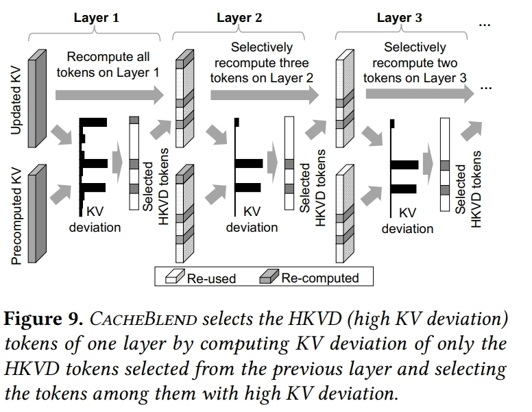

# CacheBlend: : Fast Large Language Model Serving for RAG with Cached Knowledge Fusion
<div align="center">



**🚀 Knowledge Cached Fusion Algorithm | 📄 EuroSys 2025 Paper**

[](https://github.com/ModelEngine-Group/unified-cache-management/blob/main/LICENSE)
[](https://python.org)

</div>

## 🌟 What is CacheBlend?

**CacheBlend** is a cached fusion system that combines multiple pre-computed KV caches, when their corresponding texts
are concatenated in the LLM input. By selectively recomputing the KV cache values of a small fraction of tokens, 
CacheBlend reduces TTFT by 2.2 ~ 3.3× and increases throughput by 2.8 ~ 5× under negligible quality drop.
### 🎯 Key Component

- **🔍 Loading Controller**: the Loading Controller orchestrates which KV caches to load, where from, and how much recomputation is needed.
- **⚡ KV Cache Store**: the KV Cache Store manages persistent storage, lookup, and eviction of precomputed KV caches keyed by text-chunk identity.
- **🎛️ Cache Fusor**: the Fusor merges multiple chunk-level caches into one coherent, cross-attention–correct KV cache, using minimal recomputation.

### 🔥 Key Results
- **2.2 ~ 3.3× speedup** of TTFT and **2.8 ~ 5× increase** of throughput for long sequences
- **Preserve High quality** no more than (1% ~ 3%) quality drop compared to full KV recompute

## 🧠 Ucm Implementation

### Native Block-Wise Chunk KV Cache Dump, Load, PostProcess and Recompute
1. **🔐 Chunk Hash Encoding**: Similar as prefix hash, blend connector encode the blocks of each chunk from the same hash meta beginning.
2. **⚡ Combine Prefix Cache and Chunk Cache**: Since chunk cache and native prefix cache share the same hash space, they can be stored and shared in a single store.When look up chunk cache, Blend connector first performs prefix cache lookup to the fully reused part and then conduct chunk cache lookup to fetch the candidate cache for blending.
3. **🎯 Delta-Rope PostProcess**: Rectify the loaded chunk cache according to their position in the new request.
3. **🔍 Integrate Cache Blend and First Token Generation**: Construct compute mask of the HKVD tokens, cache miss tokens and suffix tokens, then modify attention metadata to support the combination of chunk cache blending, missing cache recomputing and first token generation.
4. **🚀 Comprehensive Hook for LLM Forward Pipeline**: Based on and extended from ucm sparse, blend sparse module reduces the input tokens for all the computation kernel, not just the attention kernel.

## 🚀 Quick Start

### Installation

Blend is part of the UCM Sparse Attention module. For installation instructions, please refer to the [UCM's top-level README](https://github.com/ModelEngine-Group/unified-cache-management). Once UCM is installed, Blend is naturally supported by running the following example python scripts.

```bash
export ENABLE_SPARSE=TRUE
export DATA_DIR=/home/data/kv_cache
export MODEL_PATH=/home/models/mistralai/Mistral-7B-Instruct-v0.2
export BLEND_DATASET_PATH=/home/datasets/LongBench/data/2wikimqa.jsonl
python <ucm-repo>/examples/offline_inference_blend.py
```

### Basic Usage
Similar to UCM's `offline_inference_esa.py` examples. We only need to specify `ucm_sparse_method` to be `Blend` and specify meta config, as shown below.

```python
...
ktc = KVTransferConfig(
        kv_connector=name,
        kv_connector_module_path=module_path,
        kv_role="kv_both",
        kv_connector_extra_config={
            "ucm_connectors": [
                {
                    "ucm_connector_name": "UcmNfsStore",
                    "ucm_connector_config": {
                        "storage_backends": data_dir,
                        "kv_block_size": 33554432,
                    },
                }
            ],
            "ucm_sparse_config": {
                "Blend": {
                    "chunk_end_token_id": chunk_end_token_id,
                    "compute_meta": {
                        "model.layers.1.self_attn.attn": {
                            "ratio": 0.2,
                        },
                    },
                }
            },
            "use_layerwise": True,
        },
    )
...
```

## 📊 Supported Models
Llama-based models and Qwen-based models now are available

## 🎓 Citation

```bibtex
@inproceedings{yao2025cacheblend,
  title={CacheBlend: Fast large language model serving for RAG with cached knowledge fusion},
  author={Yao, Jiayi and Li, Hanchen and Liu, Yuhan and Ray, Siddhant and Cheng, Yihua and Zhang, Qizheng and Du, Kuntai and Lu, Shan and Jiang, Junchen},
  booktitle={Proceedings of the Twentieth European Conference on Computer Systems},
  pages={94--109},
  year={2025}
}
```