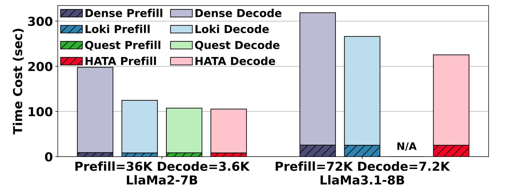
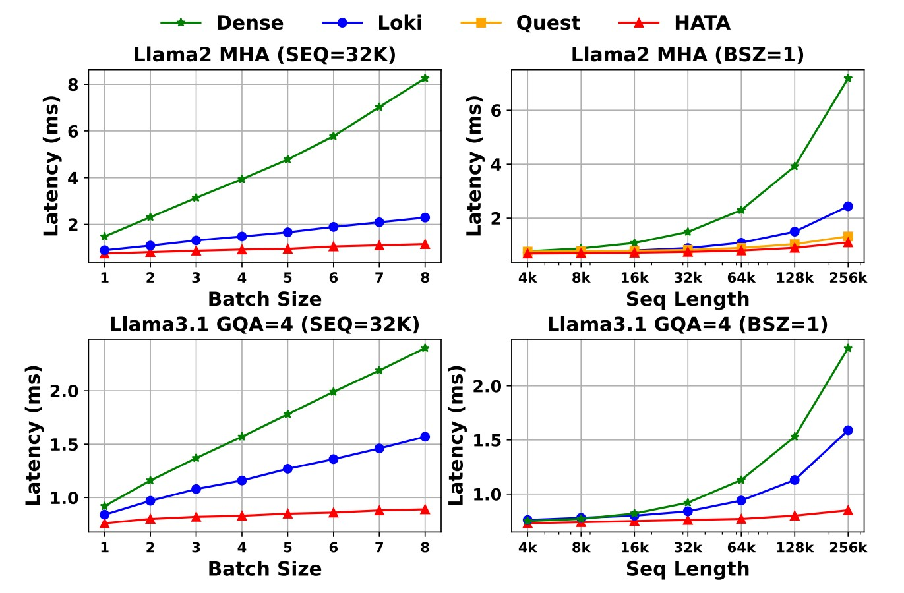

# KVComp: Hash-Aware Top-k Attention for Scalable Large Model Inference

<div align="center">


**🚀 Hash-Aware Sparse Attention Algorithm | 📄 ACL 2025 Paper | ⚡ NPU/GPU Hardware-Efficient**

[](../../_static/paper/kvcomp-ACL-2025-paper.pdf)
[](https://github.com/ModelEngine-Group/unified-cache-management/blob/main/LICENSE)
[](https://python.org)

</div>

## 🌟 What is KVComp (HATA)?

**KVComp** (Key-Value Compression) is a groundbreaking sparse attention algorithm that revolutionizes large language model inference through **Hash-Aware Top-k Attention**. Published at ACL 2025, our method achieves unprecedented efficiency by intelligently selecting the most relevant kv cache blocks using trainable hash-based similarity computation.

### 🎯 Key Innovations

- **🔍 Hash-Aware Similarity**: Uses trainable hash functions to compute attention relevance, which is significantly faster than exact attention score $QK$ computation 
- **⚡ Hardware-Efficient**: Optimized for both CUDA and NPU architectures with specialized kernels
- **🎛️ Adaptive Sparsity**: Layer-wise sparsity ratios that adapt to model characteristics
- **🔄 Dynamic Retrieval**: Real-time **query-aware** block selection based on query-key similarity
- **💾 Memory-Efficient**: Dramatically reduces KV cache HBM peak usage by leveraing UCM's offloading capability

### 🔥 Key Results
- **3-5x speedup** in attention computation for long sequences
- **Minimal accuracy loss** (< 2%) on downstream tasks
- **Scalable to 128K+ context lengths** with linear complexity

## 🏆 Performance Highlights

<div align="center">

### End-to-End Performance


### Single Layer Performance  


</div>

## 📈 Accuracy Benchmarks


<div align="center">

### LongBench Evaluation


</div>


## 🧠 How It Works

### Core Algorithm

KVComp operates through a sophisticated three-stage process:

1. **🔐 Hash Encoding**: Convert attention keys and queries into compact hash codes
2. **🎯 Similarity Computation**: Use efficient hash-based similarity to identify relevant blocks  
3. **📦 Selective Loading**: Load only the top-k most relevant KV blocks for attention

```python
# Simplified algorithm flow
def kvcomp_attention(query, key_cache, top_k_ratio):
    # 1. Hash encoding
    hash_query = hash_encoder.compute_hash(query)
    hash_keys = hash_encoder.compute_hash(key_cache)
    
    # 2. Similarity computation  
    scores = hamming_score(hash_query, hash_keys)
    
    # 3. Top-k selection
    topk_blocks = torch.topk(scores, int(len(key_cache) * top_k_ratio))
    
    # 4. Selective attention
    return attention(query, key_cache[topk_blocks], value_cache[topk_blocks])
```


### 🏗️ Architecture

The algorithm maintains three critical windows:
- **Initial Window**: First few blocks (always loaded)
- **Sparse Window**: Top-k selected blocks (dynamically chosen)
- **Local Window**: Recent blocks (always loaded)

This design ensures both **efficiency** and **accuracy** by preserving essential context while sparsifying the middle range.

## 🚀 Quick Start

### Installation

KVComp is part of the UCM Sparse Attention module. For installation instructions, please refer to the [UCM's top-level README](https://github.com/ModelEngine-Group/unified-cache-management). Once UCM is installed, KVComp is naturally supported by running the following example python scripts.

```bash
python ucm/sandbox/sparse/kvcomp/offline_inference_kvcomp.py
```

### Basic Usage
Similr to UCM's `offline_inference_esa.py` examples. We only need to specify `ucm_sparse_method` to be `KVComp` and specify a KVComp config file in `kvcomp_config_path`, as shown below.

```python
...
ktc = KVTransferConfig(
        kv_connector=name,
        kv_connector_module_path=module_path,
        kv_role="kv_both",
        kv_connector_extra_config={
            "ucm_connector_name": "UcmDram",
            "ucm_connector_config": {
                "max_cache_size": 5368709120,
                "kv_block_size": 262144,
            },
            "ucm_sparse_method": "KvComp",
            "kvcomp_config_path": "configs/kvcomp_qwen3_4B_config.json",
        },
    )
...
```

### Configuration
KvComp need a json configuration file. We have already included several configs in `configs` folder, including Qwen3-4B, Qwen3-32B, and QwQ-32B.

```text
{
    "model_name": "Qwen/Qwen3-4B",
    "is_mla": false,
    "hash_weight_type": "random",
    "num_hidden_layers": 36,
    "seq_len_threshhold": 2048,
    "chunk_size": 128,
    "chunk_repre_method": "max",
    "head_dim": 128,
    "hash_bits": 128,
    "top_k_ratio_per_layer": [0.3, 0.3, ... , 0.3],
    "top_k_index_reuse": [-1, -1, ... , -1],
    "must_select_blocks": [0, -2, -1],
}
```

## 📊 Supported Models

| Model | Size | Hash Bits | Top-k Ratio | Performance Gain |
|-------|------|-----------|-------------|------------------|
| Qwen3-4B | 4B | 128 | 0.3 | xx |
| Qwen3-32B | 32B | 128 | 0.3 | xx |
| QwQ-32B | 32B | 128 | 0.3 | xx |
| DeepSeek-R1 | 671B | 512+64 | 0.3 | xx |

## 🔧 Advanced Features


### Custom Hash Weights
```python
# Use pre-trained hash weights
config.set_hash_weight(custom_hash_weights)
```

### Hardware Optimization
- **CUDA**: Optimized kernels with bit-packing, hamming score, and top-k selection
- **NPU**: Native `npu_sign_bits_pack` operations, optimized fused kernels for hamming_dist_top_k and kv_select.
- **CPU**: SIMD-optimized implementations


## 🎓 Citation

If you use KvComp in your research, please cite our ACL 2025 paper:

```bibtex
@inproceedings{kvcomp2025,
  title={HATA: Trainable and Hardware-Efficient Hash-Aware Top-k Attention for Scalable Large Model Inference},
  author={[Ping Gong, Jiawei Yi, Shengnan Wang, Juncheng Zhang, Zewen Jin, Ouxiang Zhou, Ruibo Liu, Guanbin Xu, Youhui Bai, Bowen Ye, Kun Yuan, Tong Yang, Gong Zhang, Renhai Chen, Feng Wu, Cheng Li]},
  booktitle={Proceedings of ACL 2025},
  year={2025}
}
```

## 🤝 Contributing

We welcome contributions! Please see the **How to contribute** section of **Developer Guide** for details.


---

<div align="center">

**🌟 Star [UCM](https://github.com/ModelEngine-Group/unified-cache-management) repository if you find KvComp useful!**

</div>
