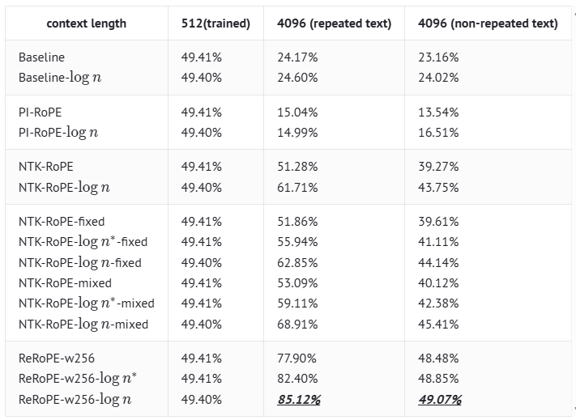

# Rectified Rotary Position Embeddings (ReRoPE)

Using ReRoPE, we can more effectively extend the context length of LLM without the need for fine-tuning. This is about the Triton implementation of ReRoPE and its integration into the vLLM inference framework.

**🚀 ReRoPE | 📄 blog [https://kexue.fm/archives/9708] [https://normxu.github.io/Rethinking-Rotary-Position-Embedding-3]**

[](https://github.com/ModelEngine-Group/unified-cache-management/blob/main/LICENSE)
[](https://python.org)


## 🌟 What is ReRoPE? 


This approach combines direct extrapolation with position interpolation. A window size $w$ is established, where a position interval of $1$ is used within the window, and an interval of $\frac{1}{k}$ is applied outside. As $k \to \infty$, this simplifies to the form illustrated above. Under this scheme, the position encoding range never exceeds $w$ regardless of input length, potentially enabling support for arbitrarily long contexts.

The attention score calculation formulas are as follows,

$$
\begin{align}
score_{ij}^{1} &= (q_iR_i)(k_jR_j)^T, && i-j<w \\
score_{ij}^{2} &= (q_iR_w)(k_j)^T, && i-j\ge w
\end{align}
$$

ReRoPE extends context length effectively but requires double attention—local within w and global compressed—significantly reducing throughput. Despite this overhead, it remains valuable for training-free long contexts, especially when combined with local attention windows to balance efficiency.

## 🧠 Triton ReRoPE Implementation

- Load Data

  Compared to the triton rope implementation, data loading requires passing query2 with alternative rotary embedding position and unrotated key2.

- Construct ReRoPE Mask

  During attention computation, the selection between attention score paths depends on the relative distance between query and key, necessitating construction of a rerope mask.

## 🏆 Results



## 🚀 Quick Start

### Installation

For installation instructions, please refer to the UCM's top-level README. Once UCM is installed, ReRoPE is naturally supported by running the following example python scripts.

```python
export VLLM_ATTENTION_BACKEND = TRITON_ATTN_VLLM_V1
export VLLM_USE_REROPE = true
export DATA_DIR=/home/data/kv_cache
export MODEL_PATH=/home/models/Qwen2.5-14B-Instruct
export REROPE_WINDOW = 32768
export TRAINING_LENGTH = 32768

python examples/offline_inference_rerope.py
```

### Basic Usage

We need to modify the max_position_embeddings of the model according to the input length of prompts, as shown below.

```python
llm_args = EngineArgs(
        model=model,
        kv_transfer_config=ktc,
        hf_overrides={
            "max_position_embeddings": 327680,
        },
        gpu_memory_utilization=0.9,
        max_num_batched_tokens=8192,
        block_size=16,
        enforce_eager=True,
        tensor_parallel_size=2,
    )
```

## 📊 Supported Models

Qwen-based models now are available


## 🎓 Cite

```
@misc{rerope2023,
  title={Rectified Rotary Position Embeddings},
  author={Jianlin Su},
  year={2023},
  howpublished={\url{https://github.com/bojone/rerope}},
}
```