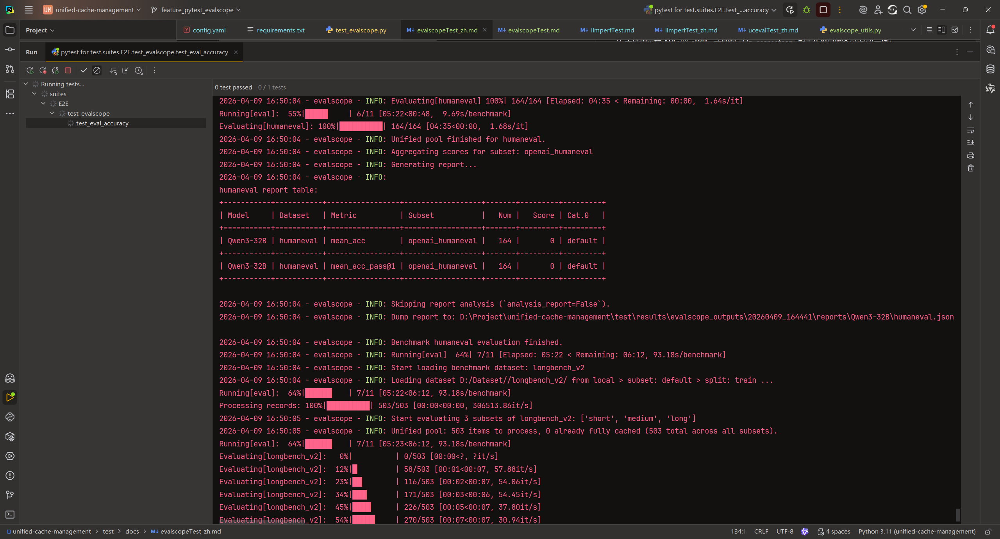
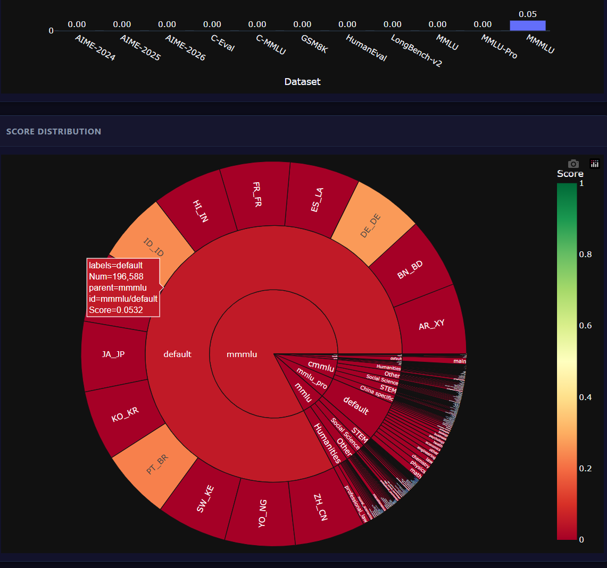
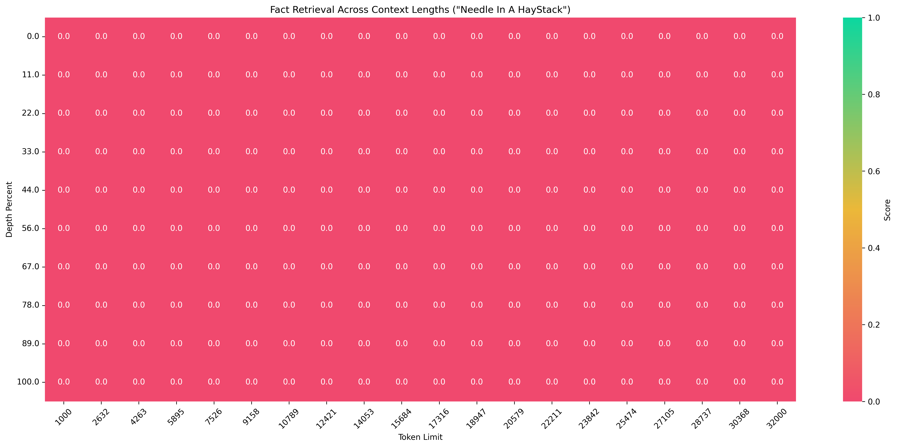

# EvalScope Accuracy Evaluation Guide

This test case is built upon **EvalScope (v1.5.2)** to provide automated evaluation capabilities, enabling convenient assessment of large language model performance on mainstream academic benchmarks and long-context retrieval tasks.

## Supported Evaluation Types

| Type | Description | Example Datasets |
|------|-------------|------------------|
| **Mainstream Benchmark Evaluation** | Standard question-answering tasks covering mathematics, reasoning, knowledge, coding, and more | `aime24`, `aime25`, `aime26`, `gsm8k`, `longbench_v2`, `ceval`, `cmmlu`, `humaneval`, `mmlu`, `mmlu_pro`, etc. |
| **Needle In A Haystack** | Evaluates the model's ability to locate specific information within extremely long contexts | - |

> **Note**: Except for the Needle In A Haystack test, only simple question-answering datasets are currently supported. Datasets requiring additional runtime environments or judge models are not yet adapted.

---

## Quick Start

### 1. Environment Setup

- It is recommended to use a virtual environment to install dependencies:
  ```bash
  cd test
  pip install -r requirements.txt
  ```

### 2. Dataset Preparation

#### Online Environment (With Internet Access)
- The framework will automatically download required datasets from ModelScope. **No manual operation is needed**.

#### Offline Environment (No Internet Access)
- Datasets must be downloaded in advance to a unified directory.
- Ensure that subdirectory names exactly match the identifiers in the task list.

**Method 1: Clone Individual Datasets**
```bash
git clone https://www.modelscope.cn/datasets/evalscope/aime26.git
git clone https://www.modelscope.cn/datasets/ZhipuAI/LongBench-v2.git   # Note: Rename the cloned directory to `longbench_v2`
git clone https://www.modelscope.cn/datasets/AI-ModelScope/Needle-in-a-Haystack-Corpus.git
```

**Method 2: Use the Pre-Packaged Dataset Archive**
- Visit the [ModelScope Dataset Repository](https://modelscope.cn/datasets/keriko/UCM_tools/files/dataset) to download the complete archive and extract it to the target path.

---

## Configuration

### General Parameters

| Environment Variable | Default | Description |
|---------------------|---------|-------------|
| `SCOPE_DATASET_ROOT` | | Root directory where datasets are stored |
| `SCOPE_TEST_LIST` | `aime24,gsm8k` (example) | Comma-separated list of datasets to evaluate |

### Needle In A Haystack Specific Parameters

| Environment Variable | Default | Description |
|----------------------|---------|-------------|
| `SCOPE_NEEDLE_MIN` | `1000` | Minimum context length (in tokens) |
| `SCOPE_NEEDLE_MAX` | `32000` | Maximum context length (in tokens) |

### Local Manual Testing
Directly modify the following constants in `test_evalscope.py`:
```python
DEFAULT_DATASET_ROOT = "/mnt/data/evalscope/dataset"  # Dataset path; can be left empty in online environments
DEFAULT_TASK_LIST = ["aime24", "gsm8k"]               # Datasets to evaluate
```

---

## Running Tests

### Single Task Execution

```bash
cd test

# Mainstream benchmark evaluation
pytest suites/E2E/test_evalscope.py::test_eval_accuracy

# Needle In A Haystack evaluation
pytest suites/E2E/test_evalscope.py::test_needle_task
```

### Batch Execution by Feature Tag

```bash
cd test
pytest --feature=evalscope
```

---

## Output and Results

### 1. EvalScope Native Output
All run records are saved under the `test/results/evalscope_outputs/` directory, organized into timestamped subdirectories, including:
- Evaluation configuration files
- Detailed request/response logs
- Aggregated metrics files (JSON)
- Visualization reports (HTML)

For detailed format information, please refer to the [EvalScope Official Documentation](https://evalscope.readthedocs.io/).

### 2. Database Persistence
Evaluation results are automatically parsed and stored in the configured database backend for centralized querying and comparison.

The following files are generated in the `test/results/` directory:
- `eval_scope.jsonl`
- `eval_scope.csv`

To customize database connections, modify the `results` section in the configuration (PostgreSQL, MongoDB, etc. are supported):

```yaml
results:
  localFile:
    path: "./results"
  # postgresql:
  #   host: "localhost"
  #   ...
  # mongodb:
  #   host: "127.0.0.1"
  #   ...
```

---

## Notes

1. Some dataset names must strictly match the ModelScope repository names (e.g., `longbench_v2` instead of `LongBench-v2`). Pay attention to directory renaming when using offline mode.
2. If using a remote API for evaluation, ensure that the `llm_connection` configuration is correct and the service is accessible (example: `http://127.0.0.1:8080/`).
3. The Needle In A Haystack task uses the **model under test itself** as the judge model. Ensure that the model possesses basic instruction-following capabilities, and configure the model path as `tokenizer_path` in `llm_connection`.

## Test Process


## Test Result Example
```json
{
	"aime25": {
		"pretty_name": "AIME-2025",
		"model": "Qwen3-32B",
		"score": 0.0,
		"metrics": [{
			"name": "mean_acc",
			"score": 0.0,
			"macro_score": 0.0,
			"num": 30,
			"categories": [{
				"name": ["default"],
				"score": 0.0,
				"macro_score": 0.0,
				"num": 30,
				"subsets": [{
					"name": "default",
					"score": 0.0,
					"num": 30
				}]
			}]
		}],
		"analysis": "N/A"
	},
	"aime25.score": 0.0,
	"model_name": "Qwen3-32B",
	"test_id": "ad9ba909-1646-47b3-89d6-9240c6497593",
	"test_items": "pytestall_cases",
	"create_at": "2026-04-09 17:00:05.910252",
	"extra_info": ""
}
```

## HTML Test Report


## Needle In A Haystack Heatmap


*Note: The screenshots above were generated using a mock model for testing, hence all scores are zero.*
